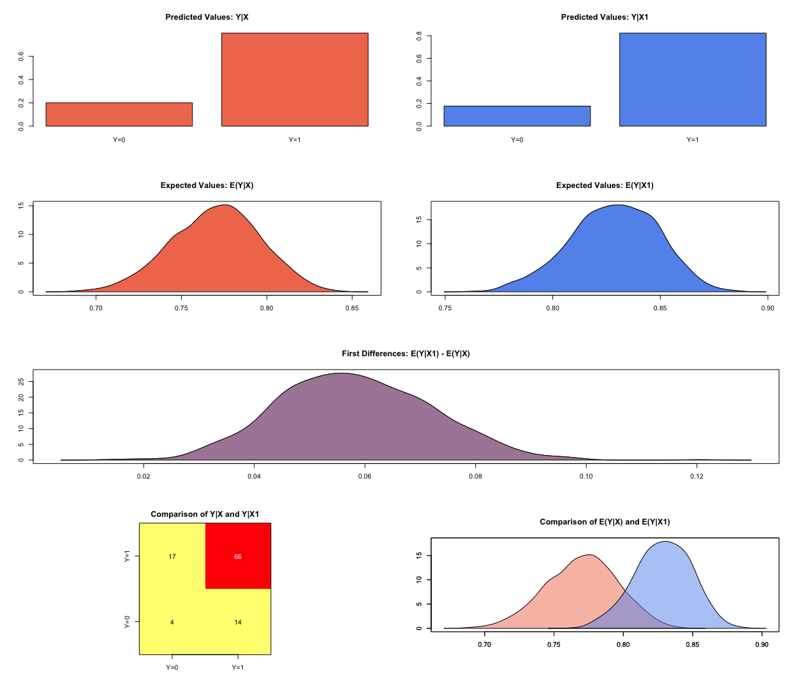
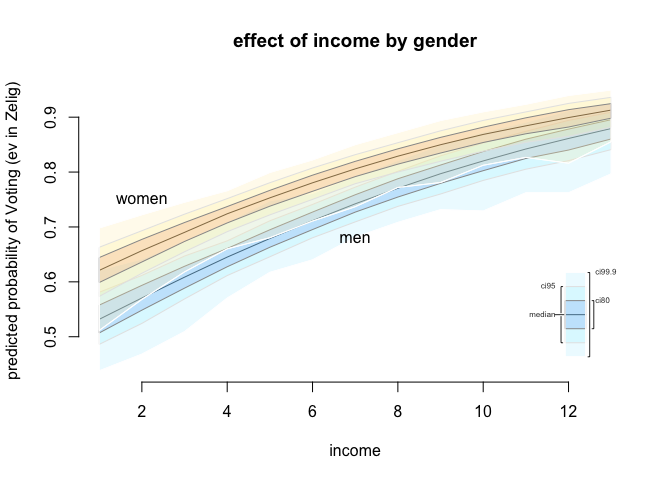

R training for SPP staff (session 2)
====================================

#### Javier Sajuria

#### 9 December 2015

Preliminary steps
-----------------

Remember to set up your working directory and open a new R script

    setwd("WD")

Now, let's load the relevant packages. If you haven't installed them last week check the website to get the right commands:

``` r
library(foreign) 
library(car)
library(readxl) 
library(texreg)
```

    Version:  1.35
    Date:     2015-04-25
    Author:   Philip Leifeld (University of Konstanz)

    Please cite the JSS article in your publications -- see citation("texreg").

``` r
library(Zelig)
```

    Loading required package: boot

    Attaching package: 'boot'

    The following object is masked from 'package:car':

        logit

    Loading required package: MASS
    Loading required package: sandwich
    ZELIG (Versions 4.2-1, built: 2013-09-12)

    +----------------------------------------------------------------+
    |  Please refer to http://gking.harvard.edu/zelig for full       |
    |  documentation or help.zelig() for help with commands and      |
    |  models support by Zelig.                                      |
    |                                                                |
    |  Zelig project citations:                                      |
    |    Kosuke Imai, Gary King, and Olivia Lau.  (2009).            |
    |    ``Zelig: Everyone's Statistical Software,''                 |
    |    http://gking.harvard.edu/zelig                              |
    |   and                                                          |
    |    Kosuke Imai, Gary King, and Olivia Lau. (2008).             |
    |    ``Toward A Common Framework for Statistical Analysis        |
    |    and Development,'' Journal of Computational and             |
    |    Graphical Statistics, Vol. 17, No. 4 (December)             |
    |    pp. 892-913.                                                |
    |                                                                |
    |   To cite individual Zelig models, please use the citation     |
    |   format printed with each model run and in the documentation. |
    +----------------------------------------------------------------+


    Attaching package: 'Zelig'

    The following object is masked from 'package:utils':

        cite

``` r
library(sandwich)
library(plm)
```

    Loading required package: Formula

``` r
library(ggplot2)
library(tidyr)
```


    Attaching package: 'tidyr'

    The following object is masked from 'package:texreg':

        extract

``` r
library(lmtest)
```

    Loading required package: zoo

    Attaching package: 'zoo'

    The following objects are masked from 'package:base':

        as.Date, as.Date.numeric

``` r
library(dplyr)
```


    Attaching package: 'dplyr'

    The following object is masked from 'package:plm':

        between

    The following objects are masked from 'package:Zelig':

        combine, summarize

    The following object is masked from 'package:MASS':

        select

    The following objects are masked from 'package:stats':

        filter, lag

    The following objects are masked from 'package:base':

        intersect, setdiff, setequal, union

Panel data
----------

We will use the WDI dataset (`wdi.data`).

``` r
wdi <- read.csv("https://raw.githubusercontent.com/UCLSPP/Staff-R-training/master/Week1/wdi.csv")
```

The function used to fit the panel data models is plm, and contains (at least) the following parameters:

    plm(formula, data, index=c(unit, time), effect = c("individual","time","twoways"),
        model = c("within","random"))

The arguments are:

| *Argument* | *Description*                                                                                                              |
|------------|----------------------------------------------------------------------------------------------------------------------------|
| `formula`  | `DV ~ IV`                                                                                                                  |
| `data`     | The dataset that contains our variables                                                                                    |
| `index`    | Here we specify which variable contains the units and which contains the time                                              |
| `effect`   | This argument defines whether we are estimating the individual fixed effects, the time fixed effect, or both (`"twoways"`) |
| `model`    | Fixed effects (`"within"`) or random effects (`"random"`)                                                                  |

### Fixed effects:

``` r
# We first estimate the OLS model, as a baseline

ols <- lm(MaternalMortality ~ SafeWaterAccess + HealthExpenditure + PregnantWomenWithAnemia, data = wdi)
summary(ols)
```


    Call:
    lm(formula = MaternalMortality ~ SafeWaterAccess + HealthExpenditure + 
        PregnantWomenWithAnemia, data = wdi)

    Residuals:
        Min      1Q  Median      3Q     Max 
    -482.57  -79.98   -3.27   53.53 1878.73 

    Coefficients:
                            Estimate Std. Error t value Pr(>|t|)    
    (Intercept)             502.7318    35.9275   13.99   <2e-16 ***
    SafeWaterAccess         -10.0763     0.2660  -37.88   <2e-16 ***
    HealthExpenditure        24.0685     1.6357   14.71   <2e-16 ***
    PregnantWomenWithAnemia  11.7967     0.4105   28.74   <2e-16 ***
    ---
    Signif. codes:  0 '***' 0.001 '**' 0.01 '*' 0.05 '.' 0.1 ' ' 1

    Residual standard error: 191.2 on 2930 degrees of freedom
      (7818 observations deleted due to missingness)
    Multiple R-squared:  0.6757,    Adjusted R-squared:  0.6754 
    F-statistic:  2035 on 3 and 2930 DF,  p-value: < 2.2e-16

``` r
fixed_effects <- plm(MaternalMortality ~ SafeWaterAccess + HealthExpenditure + PregnantWomenWithAnemia, 
                     data = wdi, 
                     index = c("CountryCode", "Year"), 
                     model = "within", 
                     effect = "individual")
summary(fixed_effects)
```

    Oneway (individual) effect Within Model

    Call:
    plm(formula = MaternalMortality ~ SafeWaterAccess + HealthExpenditure + 
        PregnantWomenWithAnemia, data = wdi, effect = "individual", 
        model = "within", index = c("CountryCode", "Year"))

    Unbalanced Panel: n=175, T=7-17, N=2934

    Residuals :
        Min.  1st Qu.   Median  3rd Qu.     Max. 
    -563.000  -15.300    0.596   13.300  534.000 

    Coefficients :
                            Estimate Std. Error  t-value  Pr(>|t|)    
    SafeWaterAccess         -8.79494    0.40917 -21.4948 < 2.2e-16 ***
    HealthExpenditure       -4.16778    1.22865  -3.3922 0.0007032 ***
    PregnantWomenWithAnemia  5.91744    0.53636  11.0325 < 2.2e-16 ***
    ---
    Signif. codes:  0 '***' 0.001 '**' 0.01 '*' 0.05 '.' 0.1 ' ' 1

    Total Sum of Squares:    15806000
    Residual Sum of Squares: 10147000
    R-Squared      :  0.35799 
          Adj. R-Squared :  0.33627 
    F-statistic: 512.248 on 3 and 2756 DF, p-value: < 2.22e-16

``` r
fixef(fixed_effects)
```

          AFG       AGO       ALB       ARE       ARG       ARM       AUS 
     895.2281  919.8473  752.9895  722.6399  766.6782  746.9677  778.0787 
          AUT       AZE       BDI       BEL       BEN       BFA       BGD 
     779.1715  544.2196 1336.1258  787.0830  742.5123  754.8887  753.3688 
          BGR       BHR       BHS       BIH       BLR       BLZ       BOL 
     755.1332  682.0568  748.2338  737.8651  762.1208  658.4077  840.5761 
          BRA       BRB       BTN       BWA       CAF       CAN       CHE 
     728.1559  730.6359  868.5490  912.1539 1372.1780  793.7236  781.3137 
          CHL       CHN       CIV       CMR       COG       COL       COM 
     750.4381  666.6156 1084.8413  997.8618  865.5965  677.4029 1031.6335 
          CPV       CRI       CUB       CYP       CZE       DEU       DJI 
     557.8910  741.0169  688.4347  733.1411  758.7518  788.6171  910.2829 
          DNK       DZA       ECU       EGY       ERI       ESP       EST 
     787.8860  749.5304  622.9354  745.5925  939.5437  771.3776  752.8397 
          ETH       FIN       FJI       FRA       FSM       GAB       GBR 
     921.9012  780.0043  621.0829  787.6041  795.9626  789.1134  797.9996 
          GEO       GHA       GIN       GMB       GNB       GNQ       GRC 
     711.1553  725.0188 1093.2592 1240.4976  930.4182  701.4041  757.0488 
          GRD       GTM       GUY       HND       HRV       HTI       HUN 
     689.2499  716.9809  800.3775  749.5464  734.6161  722.1451  751.3423 
          IDN       IND       IRL       IRN       IRQ       ISL       ISR 
     725.4980  753.4940  749.1911  729.9931  594.8984  787.2447  779.3677 
          ITA       JAM       JOR       JPN       KAZ       KEN       KGZ 
     767.9238  726.0583  779.9979  740.0963  704.9217  924.2111  619.6080 
          KHM       KIR       KOR       KWT       LAO       LBN       LBR 
     519.6146  519.7549  723.7069  731.2665  697.6801  697.6807 1343.4727 
          LBY       LCA       LKA       LSO       LTU       LUX       LVA 
     464.0917  697.1185  614.0690 1174.6033  694.7585  779.0533  760.2860 
          MAR       MDA       MDG       MDV       MEX       MKD       MLI 
     713.8166  660.3864  650.9510  728.6406  718.3071  763.1470  873.6898 
          MLT       MMR       MNE       MNG       MOZ       MRT       MUS 
     785.7035  662.5322  734.8331  509.0467  941.7322  905.1176  722.7376 
          MWI       MYS       NAM       NER       NGA       NIC       NLD 
    1130.1263  714.8234  875.2018  825.4572 1184.4262  778.1611  787.6718 
          NOR       NPL       NZL       OMN       PAK       PAN       PER 
     786.9385  907.4428  797.1922  566.9183  791.5726  722.0095  673.4769 
          PHL       PNG       POL       PRT       PRY       QAT       ROM 
     666.0577  387.6952  719.2244  763.5802  671.3381  726.5799  677.4151 
          RUS       RWA       SAU       SDN       SEN       SGP       SLB 
     760.4371 1275.2134  615.8655  789.5044  704.0704  744.3194  680.0273 
          SLE       SLV       SRB       STP       SUR       SVK       SVN 
    2437.3338  649.7161  746.0473  659.5402  833.1217  750.5592  756.9190 
          SWE       SWZ       SYR       TCD       TGO       THA       TJK 
     783.3692  875.6141  662.4981 1343.7694  609.5269  682.0908  438.0624 
          TKM       TMP       TON       TTO       TUN       TUR       TZA 
     400.8341  862.0982  821.1880  701.5059  724.0002  729.9296  913.3639 
          UGA       UKR       URY       USA       UZB       VCT       VEN 
     869.9022  758.7593  745.0221  862.0418  593.4577  698.8435  733.5592 
          VNM       VUT       WSM       YEM       ZAF       ZAR       ZMB 
     617.7027  615.2649  753.9982  733.3686  722.0298  954.9441  707.2729 

``` r
screenreg(list(ols, fixed_effects))
```


    =================================================
                             Model 1      Model 2    
    -------------------------------------------------
    (Intercept)               502.73 ***             
                              (35.93)                
    SafeWaterAccess           -10.08 ***    -8.79 ***
                               (0.27)       (0.41)   
    HealthExpenditure          24.07 ***    -4.17 ***
                               (1.64)       (1.23)   
    PregnantWomenWithAnemia    11.80 ***     5.92 ***
                               (0.41)       (0.54)   
    -------------------------------------------------
    R^2                         0.68         0.36    
    Adj. R^2                    0.68         0.34    
    Num. obs.                2934         2934       
    RMSE                      191.16                 
    =================================================
    *** p < 0.001, ** p < 0.01, * p < 0.05

The **country fixed effects** model shows `SafeWaterAccess` and `HealthExpenditure` with strong negative correlation with `MaternalMortality` and `PregnantWomenWithAnemia` with a strong positive correlation. But before we go any further, we need to check whether there are indeed any country fixed effects to begin with. We can test for that with `plmtest()` function. The `plmtest()` function can test for the presence for individual or time effects.

``` r
plmtest(fixed_effects, effect="individual")
```


        Lagrange Multiplier Test - (Honda)

    data:  MaternalMortality ~ SafeWaterAccess + HealthExpenditure + PregnantWomenWithAnemia
    normal = 137.93, p-value < 2.2e-16
    alternative hypothesis: significant effects

The null hypothesis for `plmtest()` is that there are no individual effects. The *p-value* suggests that we can reject the null hypothesis and that there are indeed country fixed effects present in our model.

We can model these time fixed effects using the `effect = "time"` argument in `plm()`.

``` r
time_effects <- plm(MaternalMortality ~ SafeWaterAccess + HealthExpenditure + PregnantWomenWithAnemia , 
                    data = wdi, 
                    index = c("CountryCode", "Year"), 
                    model = "within", 
                    effect = "time")
summary(time_effects)
```

    Oneway (time) effect Within Model

    Call:
    plm(formula = MaternalMortality ~ SafeWaterAccess + HealthExpenditure + 
        PregnantWomenWithAnemia, data = wdi, effect = "time", model = "within", 
        index = c("CountryCode", "Year"))

    Unbalanced Panel: n=175, T=7-17, N=2934

    Residuals :
       Min. 1st Qu.  Median 3rd Qu.    Max. 
    -486.00  -80.10   -3.21   51.60 1890.00 

    Coefficients :
                             Estimate Std. Error t-value  Pr(>|t|)    
    SafeWaterAccess         -10.07778    0.26654 -37.810 < 2.2e-16 ***
    HealthExpenditure        23.86712    1.64865  14.477 < 2.2e-16 ***
    PregnantWomenWithAnemia  11.87103    0.41316  28.732 < 2.2e-16 ***
    ---
    Signif. codes:  0 '***' 0.001 '**' 0.01 '*' 0.05 '.' 0.1 ' ' 1

    Total Sum of Squares:    327280000
    Residual Sum of Squares: 106910000
    R-Squared      :  0.67334 
          Adj. R-Squared :  0.66875 
    F-statistic: 2002.18 on 3 and 2914 DF, p-value: < 2.22e-16

``` r
screenreg(list(ols, fixed_effects, time_effects))
```


    ==============================================================
                             Model 1      Model 2      Model 3    
    --------------------------------------------------------------
    (Intercept)               502.73 ***                          
                              (35.93)                             
    SafeWaterAccess           -10.08 ***    -8.79 ***   -10.08 ***
                               (0.27)       (0.41)       (0.27)   
    HealthExpenditure          24.07 ***    -4.17 ***    23.87 ***
                               (1.64)       (1.23)       (1.65)   
    PregnantWomenWithAnemia    11.80 ***     5.92 ***    11.87 ***
                               (0.41)       (0.54)       (0.41)   
    --------------------------------------------------------------
    R^2                         0.68         0.36         0.67    
    Adj. R^2                    0.68         0.34         0.67    
    Num. obs.                2934         2934         2934       
    RMSE                      191.16                              
    ==============================================================
    *** p < 0.001, ** p < 0.01, * p < 0.05

When we account for these time variant factors, we notice that the `HealthExpenditure` variable is now positively correlated with MaternalMortality. One reason for this corrleation could possibly be the rising cost of healthcare in advanced countries where a greater proportion of the GDP is now spent on healthcare costs, but obviously the effects are felt in developing coutries with high maternal mortality rates.

Let's run the the Lagrange Multiplier test on the `time_effects` model again to see if indeed there are time effects in our model. Remeber, the null hypotheses for the test is that there are no time fixed effects.

``` r
plmtest(time_effects, effect="time")
```


        Lagrange Multiplier Test - time effects (Honda)

    data:  MaternalMortality ~ SafeWaterAccess + HealthExpenditure + PregnantWomenWithAnemia
    normal = -2.1755, p-value = 0.02959
    alternative hypothesis: significant effects

The *p-value* tells us that we can reject the null hypothesis as there are indeed time fixed effects present.

We already confirmed the presense of country fixed effects from the first model we estimated. In order to control for both country AND time fixed effects, we need to estimate a model using the `effect = "twoways"` argument.

``` r
twoway_effects <- plm(MaternalMortality ~ SafeWaterAccess + HealthExpenditure + PregnantWomenWithAnemia, 
                      data = wdi, 
                      index = c("CountryCode", "Year"), 
                      model = "within", 
                      effect = "twoways")
summary(twoway_effects)
```

    Twoways effects Within Model

    Call:
    plm(formula = MaternalMortality ~ SafeWaterAccess + HealthExpenditure + 
        PregnantWomenWithAnemia, data = wdi, effect = "twoways", 
        model = "within", index = c("CountryCode", "Year"))

    Unbalanced Panel: n=175, T=7-17, N=2934

    Residuals :
        Min.  1st Qu.   Median  3rd Qu.     Max. 
    -566.000  -16.500   -0.454   14.400  536.000 

    Coefficients :
                            Estimate Std. Error  t-value  Pr(>|t|)    
    SafeWaterAccess         -8.55480    0.43546 -19.6455 < 2.2e-16 ***
    HealthExpenditure       -3.68403    1.29204  -2.8513  0.004386 ** 
    PregnantWomenWithAnemia  5.28353    0.68313   7.7343  1.45e-14 ***
    ---
    Signif. codes:  0 '***' 0.001 '**' 0.01 '*' 0.05 '.' 0.1 ' ' 1

    Total Sum of Squares:    12164000
    Residual Sum of Squares: 10125000
    R-Squared      :  0.16761 
          Adj. R-Squared :  0.15653 
    F-statistic: 183.906 on 3 and 2740 DF, p-value: < 2.22e-16

The results of all three models are shown below. All three explanatory variables are statistically significant in each model. The coefficients for our explanatory variable in the twoway fixed effect model are close to the country fixed effects indicating that these factors vary greatly across countries than they do across time.

``` r
screenreg(list(fixed_effects, time_effects, twoway_effects), 
          custom.model.names = c("Country Fixed Effects", "Time Fixed Effects", "Twoway Fixed Effects"))
```


    ========================================================================================
                             Country Fixed Effects  Time Fixed Effects  Twoway Fixed Effects
    ----------------------------------------------------------------------------------------
    SafeWaterAccess            -8.79 ***             -10.08 ***           -8.55 ***         
                               (0.41)                 (0.27)              (0.44)            
    HealthExpenditure          -4.17 ***              23.87 ***           -3.68 **          
                               (1.23)                 (1.65)              (1.29)            
    PregnantWomenWithAnemia     5.92 ***              11.87 ***            5.28 ***         
                               (0.54)                 (0.41)              (0.68)            
    ----------------------------------------------------------------------------------------
    R^2                         0.36                   0.67                0.17             
    Adj. R^2                    0.34                   0.67                0.16             
    Num. obs.                2934                   2934                2934                
    ========================================================================================
    *** p < 0.001, ** p < 0.01, * p < 0.05

### More Guns, Less Crimes

We now turn our attention to serial correlation and use the Guns dataset from Stock and Watson.

Gun rights advocate John Lott argues in his book that crime rates in the United States decrease when gun ownership restrictions are relaxed. The data used in Lott's research compares violent crimes, robberies, and murders across 50 states to determine whether the so called "shall" laws that remove discretion from license granting authorities actually decrease crime rates. So far 41 states have passed "shall" laws where a person applying for a licence to carry a concealed weapon doesn't have to provide justification or "good cause" for requiring a concealed weapon permit.

``` r
guns_data <- read.csv("http://uclspp.github.io/PUBLG100/data/guns.csv")
```

The variables we're interested in are described below. You can also get the original codebook from the Stock and Watson website [here](http://wps.aw.com/wps/media/objects/11422/11696965/data3eu/Guns_Description.pdf) that describes other variables in the dataset.

| Indicator    | Definition                                                                                                                    |
|--------------|-------------------------------------------------------------------------------------------------------------------------------|
| mur          | murder rate (incidents per 100,000)                                                                                           |
| shall        | = 1 if the state has a shall-carry law in effect in that year <br>= 0 otherwise                                               |
| incarc\_rate | incarceration rate in the state in the previous year (sentenced prisoners per 100,000 residents; value for the previous year) |
| pm1029       | percent of state population that is male, ages 10 to 29                                                                       |

We will focus on murder rates in this example but you could try the same with variables measuring violent crimes or robberies as well.

Let's create a factor variable representing whether a state has passed "shall" law or not. The variable already exists as `0` or `1` but we want to convert it to a factor for our analysis.

``` r
guns_data$shall_law <- factor(guns_data$shall, levels = c(0, 1), labels =c("NO", "YES"))
```

Let's estimate a fixed effect model on panel data using the `plm()` function. We will restrict our independent variables to the `shall_law`, `incarc_rate`, and `pm1029`.

``` r
fixed_effects <- 
  plm(mur ~ shall_law + incarc_rate + pm1029, 
      data = guns_data, 
      index = c("stateid", "year"), 
      model = "within", 
      effect = "individual")

summary(fixed_effects)
```

    Oneway (individual) effect Within Model

    Call:
    plm(formula = mur ~ shall_law + incarc_rate + pm1029, data = guns_data, 
        effect = "individual", model = "within", index = c("stateid", 
            "year"))

    Balanced Panel: n=51, T=23, N=1173

    Residuals :
       Min. 1st Qu.  Median 3rd Qu.    Max. 
    -21.100  -0.959   0.016   1.080  29.000 

    Coefficients :
                   Estimate Std. Error t-value  Pr(>|t|)    
    shall_lawYES -1.4513886  0.3154300 -4.6013 4.678e-06 ***
    incarc_rate   0.0174551  0.0011261 15.4998 < 2.2e-16 ***
    pm1029        0.9582993  0.0859610 11.1481 < 2.2e-16 ***
    ---
    Signif. codes:  0 '***' 0.001 '**' 0.01 '*' 0.05 '.' 0.1 ' ' 1

    Total Sum of Squares:    12016
    Residual Sum of Squares: 9800
    R-Squared      :  0.18444 
          Adj. R-Squared :  0.17595 
    F-statistic: 84.3526 on 3 and 1119 DF, p-value: < 2.22e-16

The `state_effects` model shows that all three of our independent variables are statistically significant, with `shall_law` decreasing murder rates by `1.45` incidents per 100000 members of the population. The effects of incarceration rate and percentage of male population between 10 and 29 years old are also statistically significant.

``` r
plmtest(fixed_effects, effect="individual")
```


        Lagrange Multiplier Test - (Honda)

    data:  mur ~ shall_law + incarc_rate + pm1029
    normal = 47.242, p-value < 2.2e-16
    alternative hypothesis: significant effects

The p-value suggests the presence of state effects so let's run a two-way fixed effect model incroporating both state effects and time effects.

``` r
twoway_effects <- 
  plm(mur ~ shall_law + incarc_rate + pm1029, 
      data = guns_data, 
      index = c("stateid", "year"), 
      model = "within", 
      effect = "twoways")

summary(twoway_effects)
```

    Twoways effects Within Model

    Call:
    plm(formula = mur ~ shall_law + incarc_rate + pm1029, data = guns_data, 
        effect = "twoways", model = "within", index = c("stateid", 
            "year"))

    Balanced Panel: n=51, T=23, N=1173

    Residuals :
         Min.   1st Qu.    Median   3rd Qu.      Max. 
    -19.20000  -0.97500  -0.00697   1.01000  27.10000 

    Coefficients :
                   Estimate Std. Error t-value  Pr(>|t|)    
    shall_lawYES -0.5640474  0.3325054 -1.6964 0.0901023 .  
    incarc_rate   0.0209756  0.0011252 18.6411 < 2.2e-16 ***
    pm1029        0.7326357  0.2189770  3.3457 0.0008485 ***
    ---
    Signif. codes:  0 '***' 0.001 '**' 0.01 '*' 0.05 '.' 0.1 ' ' 1

    Total Sum of Squares:    11263
    Residual Sum of Squares: 8519.4
    R-Squared      :  0.24357 
          Adj. R-Squared :  0.22779 
    F-statistic: 117.746 on 3 and 1097 DF, p-value: < 2.22e-16

In a twoway fixed effects model `shall_law` is no longer significant and the effect of male population between 10 and 29 years old has decreased from 0.95 to 0.73 incidents per 100,000 population.

### Serial Correlation

For time series data we need to address the potential for serial correlation in the error term. We will test for serial correlation with Breusch-Godfrey test using `pbgtest()` and provide solutions for correcting it if necessary.

``` r
pbgtest(twoway_effects)
```


        Breusch-Godfrey/Wooldridge test for serial correlation in panel
        models

    data:  mur ~ shall_law + incarc_rate + pm1029
    chisq = 765.16, df = 23, p-value < 2.2e-16
    alternative hypothesis: serial correlation in idiosyncratic errors

The null hypothesis for the Breusch-Godfrey test is that there is no serial correlation. The `p-value` from the test tells us that we can reject the null hypothesis and confirms the presence of serial corrleation in our error term.

We can correct for serial correlation using `coeftest()` similar to how we corrected for heteroskedastic errors. We'll use the `vcovHC()` function for obtaining a heteroskedasticity-consistent covariance matrix, but since we're interested in correcting for autocorrelation as well, we will specify `method = "arellano"` which corrects for both heteroskedasticity and autocorrelation.

``` r
twoway_effects_hac <- coeftest(twoway_effects, vcov = vcovHC(twoway_effects, method = "arellano", type = "HC3"))

screenreg(list(twoway_effects, twoway_effects_hac),
          custom.model.names = c("Twoway Fixed Effects", "Twoway Fixed Effects (HAC)"))
```


    ==============================================================
                  Twoway Fixed Effects  Twoway Fixed Effects (HAC)
    --------------------------------------------------------------
    shall_lawYES    -0.56               -0.56                     
                    (0.33)              (0.48)                    
    incarc_rate      0.02 ***            0.02 *                   
                    (0.00)              (0.01)                    
    pm1029           0.73 ***            0.73                     
                    (0.22)              (0.54)                    
    --------------------------------------------------------------
    R^2              0.24                                         
    Adj. R^2         0.23                                         
    Num. obs.     1173                                            
    ==============================================================
    *** p < 0.001, ** p < 0.01, * p < 0.05

We can see that with heteroskedasticity and autocorrelation consistent (HAC) standard errors, the percent of male population (10 - 29 yr old) is no longer a significant predictor in our model.

### Lagged Dependent Variables (LDV) and Dynamic Models

Another way to address serial correlation is by modeling the time dependence directly. We can think of a dynamic model as one that takes into account whether changes in the predictor variables have an immediate effect on our dependent variable or whether the effects are distributed over time. In our example, do changes in gun laws affect murder rates immediately or are the effects distributed over time?

We can account time dependence by incorporating a Lagged Dependent Variable (LDV) in our model. A Lagged Dependent Variable (LDV) (as the name suggests) is one that "lags" behind the original observation by *t* time-periods. The `lag()` function generates lagged dependent variables and has the following form:

    lag(x, k)

| Argument | Description                        |
|----------|------------------------------------|
| `x`      | A vector or matrix of observations |
| `k`      | Number of lags. Default is `1`     |

``` r
ldv_model <- 
  plm(mur ~ lag(mur) + shall_law + incarc_rate + pm1029, 
      data = guns_data, 
      index = c("stateid", "year"), 
      model = "within", 
      effect = "twoways")

summary(ldv_model)
```

    Twoways effects Within Model

    Call:
    plm(formula = mur ~ lag(mur) + shall_law + incarc_rate + pm1029, 
        data = guns_data, effect = "twoways", model = "within", index = c("stateid", 
            "year"))

    Unbalanced Panel: n=51, T=22-23, N=1172

    Residuals :
        Min.  1st Qu.   Median  3rd Qu.     Max. 
    -23.8000  -0.6240   0.0133   0.6130  17.2000 

    Coefficients :
                   Estimate Std. Error t-value  Pr(>|t|)    
    lag(mur)      0.6553529  0.0185809 35.2702 < 2.2e-16 ***
    shall_lawYES -0.0923557  0.2277497 -0.4055  0.685179    
    incarc_rate   0.0029214  0.0009262  3.1541  0.001654 ** 
    pm1029        0.3839174  0.1501383  2.5571  0.010689 *  
    ---
    Signif. codes:  0 '***' 0.001 '**' 0.01 '*' 0.05 '.' 0.1 ' ' 1

    Total Sum of Squares:    11252
    Residual Sum of Squares: 3972.3
    R-Squared      :  0.64697 
          Adj. R-Squared :  0.60446 
    F-statistic: 501.669 on 4 and 1095 DF, p-value: < 2.22e-16

### Cross Sectional Dependence

If a federal law imposed restrictions on gun ownership or licensing requirements then the changes would likely affect all 50 states. This is an example of Cross Sectional Dependence and not accounted for in a fixed effect model. Other scenarios could also trigger cross sectional dependence that we should take into consideration. For example, security policies and law enforment efforts might change after an extraordinary event (think of mass shootings or terrorist attacks) thus affecting law enforment practices in all states. We can check for cross sectional dependence using the Pesaran cross sectional dependence test or `pcdtest()`.

``` r
pcdtest(twoway_effects)
```


        Pesaran CD test for cross-sectional dependence in panels

    data:  formula
    z = 3.9121, p-value = 9.148e-05
    alternative hypothesis: cross-sectional dependence

As we've seen with other tests, the null hypothesis is that there is no cross sectional dependence. The p-value, however tells that there is indeed cross-sectional dependence and we need to correct it. There are two general approaches to correcting for cross sectional dependence.

**Beck and Katz (1995) method or Panel Corrected Standard Errors (PCSE)**: We can obtain Panel Corrected Standard Errors (PCSE) by first obtaining a robust variance-covariance matrix for panel models with the Beck and Katz (1995) method using the `vcovBK()` and passing it to the familiar `coeftest()` function.

``` r
twoway_effects_pcse <- coeftest(twoway_effects, vcov = vcovBK(twoway_effects, type="HC3", cluster = "group")) 
```

The results from PCSE are sensitive to the ratio between the number of time periods in the dataset (T) and the total number of observations (N). When we're dealing with large datasets (i.e. the T/N ratio is small), we use the Driscoll and Kraay method:

**Driscoll and Kraay (1998) (SCC)**: The cross-sectional and serial correlation (SCC) method by Driscoll and Kraay addresses the limitations of Beck and Katz's PCSE method is therefore preferred for obtaining heteroskedasticity and autocorrelation consistent errors that are also robust to cross-sectional dependence.

``` r
twoway_effects_scc <- coeftest(twoway_effects, vcov = vcovSCC(twoway_effects, type="HC3", cluster = "group"))
```

``` r
screenreg(list(fixed_effects, twoway_effects, ldv_model, twoway_effects_pcse, twoway_effects_scc), 
          custom.model.names = c("Country Effects", "Twoway Fixed Effects", "LDV", "PCSE", "SCC"))
```


    ======================================================================================
                  Country Effects  Twoway Fixed Effects  LDV          PCSE       SCC      
    --------------------------------------------------------------------------------------
    shall_lawYES    -1.45 ***        -0.56                 -0.09      -0.56      -0.56    
                    (0.32)           (0.33)                (0.23)     (0.77)     (0.43)   
    incarc_rate      0.02 ***         0.02 ***              0.00 **    0.02 ***   0.02 ***
                    (0.00)           (0.00)                (0.00)     (0.00)     (0.01)   
    pm1029           0.96 ***         0.73 ***              0.38 *     0.73       0.73    
                    (0.09)           (0.22)                (0.15)     (0.51)     (0.39)   
    lag(mur)                                                0.66 ***                      
                                                           (0.02)                         
    --------------------------------------------------------------------------------------
    R^2              0.18             0.24                  0.65                          
    Adj. R^2         0.18             0.23                  0.60                          
    Num. obs.     1173             1173                  1172                             
    ======================================================================================
    *** p < 0.001, ** p < 0.01, * p < 0.05

Logistic Models
---------------

For fitting a logistic model, we will use a subset of the 2010 BES. We will remove any missing data:

``` r
bes <- read.dta("http://uclspp.github.io/PUBLG100/data/bes.dta")
bes <- na.omit(bes)
head(bes)
```

      Turnout Vote2001 Income Age Gender PartyID Influence Attention Telephone
    1       0        1      4  76      0       1         1         8         1
    2       1        1      5  32      1       0         3         8         1
    4       0        1      1  35      0       0         1         1         0
    5       1        1      7  56      1       0         1         9         1
    6       1        1      4  76      0       1         4         8         1
    7       0        1      7  32      1       0         4         8         1
      LeftrightSelf CivicDutyIndex polinfoindex edu15 edu16 edu17 edu18
    1             7             20            7     1     0     0     0
    2             6             15            5     0     1     0     0
    4             5             26            1     0     1     0     0
    5             9             16            7     0     0     1     0
    6             8             16            4     0     1     0     0
    7             5             19            4     0     1     0     0
      edu19plus in_school in_uni cs_id
    1         0         0      0     1
    2         0         0      0     2
    4         0         0      0     4
    5         0         0      0     5
    6         0         0      0     6
    7         0         0      0     7

The function we use to fit logistic models is `glm()`, and is very similar to the `lm()` function we used for linear models.

    glm(formula, data, family)

The new argument is `family`, which needs to be set as `family=binomial(link="logit")` to fit logistic models. We will estimate the probability of voting using the following independent variables:

| **Variable**   | **Description**                                     |
|----------------|-----------------------------------------------------|
| `Income`       | Groups of income from lowest (1) to highest (13)    |
| `polinfoindex` | Index of political information from 0 to 8          |
| `Gender`       | 0 if male, 1 if female                              |
| `edu15`        | Left education when they were 15 years old          |
| `edu17`        | Left education when they were 17 years old          |
| `edu18`        | Left education when they were 18 years old          |
| `edu19plus`    | Left education when they were 19 years old or older |
| `in_school`    | Whether respondent is currently in school           |
| `in_uni`       | Whether respondent is currently in university       |

``` r
m1 <- glm(factor(Turnout) ~ Income + polinfoindex + Gender + edu15 + edu17 + edu18 + 
            edu19plus + in_school + in_uni, family = binomial(link = "logit"),
          data = bes)
screenreg(m1)
```


    ============================
                    Model 1     
    ----------------------------
    (Intercept)        -1.16 ***
                       (0.15)   
    Income              0.03    
                       (0.02)   
    polinfoindex        0.38 ***
                       (0.02)   
    Gender             -0.36 ***
                       (0.08)   
    edu15               0.39 ***
                       (0.10)   
    edu17               0.47 ** 
                       (0.15)   
    edu18               0.12    
                       (0.14)   
    edu19plus           0.24    
                       (0.12)   
    in_school           0.10    
                       (0.39)   
    in_uni             -0.72 ** 
                       (0.26)   
    ----------------------------
    AIC              4386.40    
    BIC              4449.71    
    Log Likelihood  -2183.20    
    Deviance         4366.40    
    Num. obs.        4152       
    ============================
    *** p < 0.001, ** p < 0.01, * p < 0.05

According to this model, the probability of voting increases when the respondent has more political information, and left education earlier. The probability decreases if the respondent is male or if it is in university.

Predicted Probabilities and Predictive Power
--------------------------------------------

We first need to get the latent variable `y`. For each observation in the data we do `y = alpha + beta1 * X1 + beta2 * X2....`

``` r
y.latent <- predict(m1)
```

Result: vector containing the latent y for each combination of covariates in the data

``` r
head(y.latent)
```

             1          2          4          5          6          7 
     2.0509649  0.5678090 -0.7454419  1.8700108  0.5096579  0.2539451 

Now that we have the latent variable, we put it into the link function to get our precicted probabilities. The link function is: `1 / (1 + exp(- y.latent))`

``` r
pred.probs <- 1 / (1 + exp(-y.latent))
summary(pred.probs)
```

       Min. 1st Qu.  Median    Mean 3rd Qu.    Max. 
     0.1893  0.6595  0.7791  0.7406  0.8449  0.9360 

Let's compare our predictions to observed outcomes

``` r
observed <- bes$Turnout # those are the observed outcomes
exp.vals <- rep(0,length(observed))
# threshold to translate predicted probabilities into outcomes
threshold <- .5 
# everyone with a predicted prob > .5 is predicted to turnout
exp.vals[which(pred.probs > threshold)] <- 1
# puttint observed and predicted into a table
qual.pred <- table(observed,exp.vals)
qual.pred
```

            exp.vals
    observed    0    1
           0  160  917
           1  106 2969

Interpreting the table:

| -               | Predicted values         | -                     |
|-----------------|--------------------------|-----------------------|
| -               | Correct negatives (Good) | False Positives (Bad) |
| Observed values | -                        | -                     |
| -               | False negatives (Bad)    | Correct Positives     |

We can estimate the proportion of correctly predicted cases using: `(correct negatives + correct positives) / total number of outcomes`

``` r
(qual.pred[1,1] + qual.pred[2,2]) / sum(qual.pred)
```

    [1] 0.7536127

``` r
# we correctly predict 63.5% of the cases in the data set


median(bes$Turnout) # the modal category of Turnout is 1
```

    [1] 1

``` r
mean(bes$Turnout)
```

    [1] 0.7406069

### Joint hypothesis testing

Let's add more variables to our model. `Influence` measures how much Rs believe they can influence politics. This is often used as the `p` (probability to cast the decisive vote) in the rational voter model. We will also add Age, which is a common control

``` r
m2 <- glm(Turnout ~ Income + polinfoindex + Influence + Gender + Age +edu15 + 
            edu17 + edu18 + edu19plus + in_school + in_uni, 
          family = binomial(link = "logit"), data = bes)

summary(m2)
```


    Call:
    glm(formula = Turnout ~ Income + polinfoindex + Influence + Gender + 
        Age + edu15 + edu17 + edu18 + edu19plus + in_school + in_uni, 
        family = binomial(link = "logit"), data = bes)

    Deviance Residuals: 
        Min       1Q   Median       3Q      Max  
    -3.0007  -0.6333   0.4976   0.7263   2.0955  

    Coefficients:
                  Estimate Std. Error z value Pr(>|z|)    
    (Intercept)  -3.933553   0.224372 -17.531  < 2e-16 ***
    Income        0.154802   0.021427   7.225 5.02e-13 ***
    polinfoindex  0.254859   0.024344  10.469  < 2e-16 ***
    Influence     0.209778   0.019326  10.855  < 2e-16 ***
    Gender       -0.364160   0.082195  -4.430 9.40e-06 ***
    Age           0.048830   0.003137  15.564  < 2e-16 ***
    edu15        -0.327864   0.112454  -2.916  0.00355 ** 
    edu17         0.363308   0.159270   2.281  0.02254 *  
    edu18         0.141457   0.152914   0.925  0.35493    
    edu19plus     0.012540   0.130220   0.096  0.92328    
    in_school     1.098707   0.402382   2.731  0.00632 ** 
    in_uni       -0.046456   0.270463  -0.172  0.86362    
    ---
    Signif. codes:  0 '***' 0.001 '**' 0.01 '*' 0.05 '.' 0.1 ' ' 1

    (Dispersion parameter for binomial family taken to be 1)

        Null deviance: 4753.4  on 4151  degrees of freedom
    Residual deviance: 3965.6  on 4140  degrees of freedom
    AIC: 3989.6

    Number of Fisher Scoring iterations: 5

``` r
screenreg(list(m1, m2))
```


    ==========================================
                    Model 1       Model 2     
    ------------------------------------------
    (Intercept)        -1.16 ***     -3.93 ***
                       (0.15)        (0.22)   
    Income              0.03          0.15 ***
                       (0.02)        (0.02)   
    polinfoindex        0.38 ***      0.25 ***
                       (0.02)        (0.02)   
    Gender             -0.36 ***     -0.36 ***
                       (0.08)        (0.08)   
    edu15               0.39 ***     -0.33 ** 
                       (0.10)        (0.11)   
    edu17               0.47 **       0.36 *  
                       (0.15)        (0.16)   
    edu18               0.12          0.14    
                       (0.14)        (0.15)   
    edu19plus           0.24          0.01    
                       (0.12)        (0.13)   
    in_school           0.10          1.10 ** 
                       (0.39)        (0.40)   
    in_uni             -0.72 **      -0.05    
                       (0.26)        (0.27)   
    Influence                         0.21 ***
                                     (0.02)   
    Age                               0.05 ***
                                     (0.00)   
    ------------------------------------------
    AIC              4386.40       3989.62    
    BIC              4449.71       4065.59    
    Log Likelihood  -2183.20      -1982.81    
    Deviance         4366.40       3965.62    
    Num. obs.        4152          4152       
    ==========================================
    *** p < 0.001, ** p < 0.01, * p < 0.05

To test the goodness-of-fit of our second model, we can use the likelihood ratio test:

``` r
lrtest(m1, m2)
```

    Likelihood ratio test

    Model 1: factor(Turnout) ~ Income + polinfoindex + Gender + edu15 + edu17 + 
        edu18 + edu19plus + in_school + in_uni
    Model 2: Turnout ~ Income + polinfoindex + Influence + Gender + Age + 
        edu15 + edu17 + edu18 + edu19plus + in_school + in_uni
      #Df  LogLik Df  Chisq Pr(>Chisq)    
    1  10 -2183.2                         
    2  12 -1982.8  2 400.78  < 2.2e-16 ***
    ---
    Signif. codes:  0 '***' 0.001 '**' 0.01 '*' 0.05 '.' 0.1 ' ' 1

Other measures of GoF are the AIC (Akaike's Information Criterion) and the BIC (Bayesian Information Criterion) scores. In general, the rule of thumb is that the smaller the AIC and the BIC, the better is the fit of the model

``` r
AIC(m1, m2)
```

       df      AIC
    m1 10 4386.400
    m2 12 3989.618

``` r
BIC(m1, m2) 
```

       df      BIC
    m1 10 4449.713
    m2 12 4065.594

### Using `Zelig` to produce substantial results and plots of the predicted probabilities

The Zelig package estimates a large number of models, using a very similar syntax to the one we have learnt for linear models (`lm()`), generalised linear models (`glm()`) or panel data models (`plm()`). This package creates standardised objects that then can be used to estimate the predicted probabilities using simulations (or bootstrapping) for the uncertainty of the estimates.

To estimate a model with `Zelig` we need to use the `zelig()` function. Note that the main difference is the `model - "logit"` argument.

``` r
# z.out is identical to m2
z.out <- zelig(Turnout ~ Income + polinfoindex + Influence + Gender + Age + edu15 + 
            edu17 + edu18 + edu19plus + in_school + in_uni, model = "logit", 
            data = bes, cite = F)
```

We now need to define a meaningful profile to estimate the predicted probabilities. We will compare a women of 18 years of education to a man with the same education. The `setx()` indicates the values of `x` at which we want to predict the probabilities.

``` r
x.fem.18 <- setx(z.out, Income = median(bes$Income), polinfoindex = median(bes$polinfoindex), 
                 Influence = median(bes$Influence), Gender = 1, Age = median(bes$Age), 
                 edu15 = 0, edu17 = 0, edu18 = 1, edu19plus = 0, in_school = 0, in_uni = 0)
x.fem.18$values # check the values you have set
```

    $Income
    [1] 5

    $polinfoindex
    [1] 6

    $Influence
    [1] 3

    $Gender
    [1] 1

    $Age
    [1] 50

    $edu15
    [1] 0

    $edu17
    [1] 0

    $edu18
    [1] 1

    $edu19plus
    [1] 0

    $in_school
    [1] 0

    $in_uni
    [1] 0

``` r
x.male.18 <- setx(z.out, Income = median(bes$Income), polinfoindex = median(bes$polinfoindex), 
                 Influence = median(bes$Influence), Gender = 0, Age = median(bes$Age), 
                 edu15 = 0, edu17 = 0, edu18 = 1, edu19plus = 0, in_school = 0, in_uni = 0)
x.male.18$values
```

    $Income
    [1] 5

    $polinfoindex
    [1] 6

    $Influence
    [1] 3

    $Gender
    [1] 0

    $Age
    [1] 50

    $edu15
    [1] 0

    $edu17
    [1] 0

    $edu18
    [1] 1

    $edu19plus
    [1] 0

    $in_school
    [1] 0

    $in_uni
    [1] 0

We now use the `sim()` function to simulate the uncertainty around each of the profiles.

``` r
s.out <- sim(z.out, x = x.fem.18, x1 = x.male.18)
# let's check the quantities of interest
names(s.out$qi)
```

    [1] "Expected Values: E(Y|X)"            
    [2] "Expected Values: E(Y|X1)"           
    [3] "Predicted Values: Y|X"              
    [4] "Predicted Values: Y|X1"             
    [5] "First Differences: E(Y|X1) - E(Y|X)"

``` r
# expected values express the probability of assigning a 1 to the response variable (Turnout)
# predicted values express our model prediction (0 or 1) for the response variable (Turnout)
```

We can illustrate this using numbers (you can write two commands in a single line separated by a semicolon)

``` r
ev.fem <- sort(s.out$qi$ev1); ev.men <- sort(s.out$qi$ev2) 
women <- c(ev.fem[25], ev.fem[500], ev.fem[975])
men <- c(ev.men[25], ev.men[500], ev.men[975])
final <- rbind(round(women,2), round(men,2))
colnames(final) = c("2.5%", "Mean", "97.5%")
rownames(final) = c("female","male")
final
```

           2.5% Mean 97.5%
    female 0.72 0.77  0.82
    male   0.79 0.83  0.87

``` r
# or in 1 line
summary(s.out)
```


    Model:  logit 
    Number of simulations:  1000 

    Values of X
      (Intercept) Income polinfoindex Influence Gender Age edu15 edu17 edu18
    1           1      5            6         3      1  50     0     0     1
      edu19plus in_school in_uni
    1         0         0      0
    attr(,"assign")
     [1]  0  1  2  3  4  5  6  7  8  9 10 11

    Values of X1
      (Intercept) Income polinfoindex Influence Gender Age edu15 edu17 edu18
    1           1      5            6         3      0  50     0     0     1
      edu19plus in_school in_uni
    1         0         0      0
    attr(,"assign")
     [1]  0  1  2  3  4  5  6  7  8  9 10 11

    Expected Values: E(Y|X) 
     mean    sd   50%  2.5% 97.5%
     0.77 0.026 0.771 0.719 0.818

    Expected Values: E(Y|X1) 
      mean   sd   50%  2.5% 97.5%
     0.829 0.02 0.829 0.787 0.865

    Predicted Values: Y|X 
         0     1
     0.201 0.799

    Predicted Values: Y|X1 
         0     1
     0.177 0.823

    First Differences: E(Y|X1) - E(Y|X) 
      mean    sd   50%  2.5% 97.5%
     0.058 0.014 0.058 0.033 0.086

``` r
# graphically
plot(s.out)
```



We can also produce predicted probabilities for continuous variables:

``` r
x.fem <- setx(z.out, Income = 1:13, polinfoindex = median(bes$polinfoindex), 
             Influence = median(bes$Influence), Gender = 1, Age =median(bes$Age), 
             edu15 = 1, edu17 = 0, edu18 = 0, edu19plus = 0, in_school = 0, in_uni = 0)
x.mal <- setx(z.out, Income = 1:13, polinfoindex = median(bes$polinfoindex), 
              Influence = median(bes$Influence), Gender = 0, Age =median(bes$Age), 
              edu15 = 1, edu17 = 0, edu18 = 0, edu19plus = 0, in_school = 0, in_uni = 0)
names(x.fem)
```

     [1] "Income=1, polinfoindex=6, Influence=3, Gender=1, Age=50, edu15=1, edu17=0, edu18=0, edu19plus=0, in_school=0, in_uni=0" 
     [2] "Income=2, polinfoindex=6, Influence=3, Gender=1, Age=50, edu15=1, edu17=0, edu18=0, edu19plus=0, in_school=0, in_uni=0" 
     [3] "Income=3, polinfoindex=6, Influence=3, Gender=1, Age=50, edu15=1, edu17=0, edu18=0, edu19plus=0, in_school=0, in_uni=0" 
     [4] "Income=4, polinfoindex=6, Influence=3, Gender=1, Age=50, edu15=1, edu17=0, edu18=0, edu19plus=0, in_school=0, in_uni=0" 
     [5] "Income=5, polinfoindex=6, Influence=3, Gender=1, Age=50, edu15=1, edu17=0, edu18=0, edu19plus=0, in_school=0, in_uni=0" 
     [6] "Income=6, polinfoindex=6, Influence=3, Gender=1, Age=50, edu15=1, edu17=0, edu18=0, edu19plus=0, in_school=0, in_uni=0" 
     [7] "Income=7, polinfoindex=6, Influence=3, Gender=1, Age=50, edu15=1, edu17=0, edu18=0, edu19plus=0, in_school=0, in_uni=0" 
     [8] "Income=8, polinfoindex=6, Influence=3, Gender=1, Age=50, edu15=1, edu17=0, edu18=0, edu19plus=0, in_school=0, in_uni=0" 
     [9] "Income=9, polinfoindex=6, Influence=3, Gender=1, Age=50, edu15=1, edu17=0, edu18=0, edu19plus=0, in_school=0, in_uni=0" 
    [10] "Income=10, polinfoindex=6, Influence=3, Gender=1, Age=50, edu15=1, edu17=0, edu18=0, edu19plus=0, in_school=0, in_uni=0"
    [11] "Income=11, polinfoindex=6, Influence=3, Gender=1, Age=50, edu15=1, edu17=0, edu18=0, edu19plus=0, in_school=0, in_uni=0"
    [12] "Income=12, polinfoindex=6, Influence=3, Gender=1, Age=50, edu15=1, edu17=0, edu18=0, edu19plus=0, in_school=0, in_uni=0"
    [13] "Income=13, polinfoindex=6, Influence=3, Gender=1, Age=50, edu15=1, edu17=0, edu18=0, edu19plus=0, in_school=0, in_uni=0"

``` r
names(x.mal)
```

     [1] "Income=1, polinfoindex=6, Influence=3, Gender=0, Age=50, edu15=1, edu17=0, edu18=0, edu19plus=0, in_school=0, in_uni=0" 
     [2] "Income=2, polinfoindex=6, Influence=3, Gender=0, Age=50, edu15=1, edu17=0, edu18=0, edu19plus=0, in_school=0, in_uni=0" 
     [3] "Income=3, polinfoindex=6, Influence=3, Gender=0, Age=50, edu15=1, edu17=0, edu18=0, edu19plus=0, in_school=0, in_uni=0" 
     [4] "Income=4, polinfoindex=6, Influence=3, Gender=0, Age=50, edu15=1, edu17=0, edu18=0, edu19plus=0, in_school=0, in_uni=0" 
     [5] "Income=5, polinfoindex=6, Influence=3, Gender=0, Age=50, edu15=1, edu17=0, edu18=0, edu19plus=0, in_school=0, in_uni=0" 
     [6] "Income=6, polinfoindex=6, Influence=3, Gender=0, Age=50, edu15=1, edu17=0, edu18=0, edu19plus=0, in_school=0, in_uni=0" 
     [7] "Income=7, polinfoindex=6, Influence=3, Gender=0, Age=50, edu15=1, edu17=0, edu18=0, edu19plus=0, in_school=0, in_uni=0" 
     [8] "Income=8, polinfoindex=6, Influence=3, Gender=0, Age=50, edu15=1, edu17=0, edu18=0, edu19plus=0, in_school=0, in_uni=0" 
     [9] "Income=9, polinfoindex=6, Influence=3, Gender=0, Age=50, edu15=1, edu17=0, edu18=0, edu19plus=0, in_school=0, in_uni=0" 
    [10] "Income=10, polinfoindex=6, Influence=3, Gender=0, Age=50, edu15=1, edu17=0, edu18=0, edu19plus=0, in_school=0, in_uni=0"
    [11] "Income=11, polinfoindex=6, Influence=3, Gender=0, Age=50, edu15=1, edu17=0, edu18=0, edu19plus=0, in_school=0, in_uni=0"
    [12] "Income=12, polinfoindex=6, Influence=3, Gender=0, Age=50, edu15=1, edu17=0, edu18=0, edu19plus=0, in_school=0, in_uni=0"
    [13] "Income=13, polinfoindex=6, Influence=3, Gender=0, Age=50, edu15=1, edu17=0, edu18=0, edu19plus=0, in_school=0, in_uni=0"

``` r
s.out2 <- sim(z.out, x = x.fem, x1 = x.mal)

# illustrate
plot.ci(s.out2, 
        xlab = "income", 
        ylab = "predicted probability of Voting (ev in Zelig)",
        main = "effect of income by gender")
text(x=2,y=.75,labels="women")
text(x=7,y=.68,labels="men")
```


