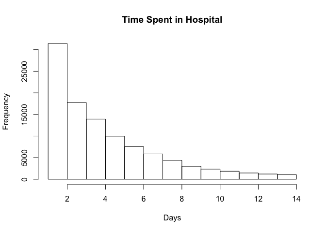
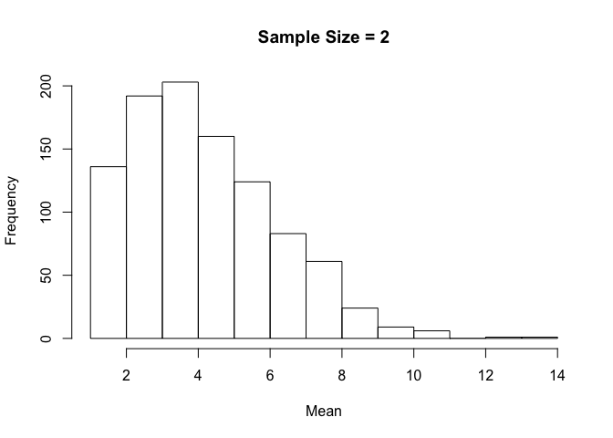
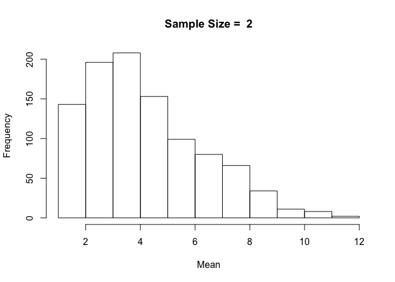
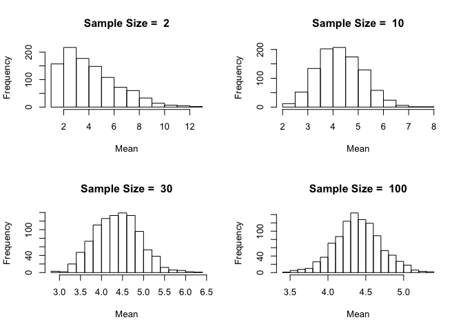

### Central Limit Theorem

Here's an example of Central Limit Theorem with a real-world dataset. The dataset includes observations from 130 U.S. hospitals from 1999-2008.

As we plot the frequency distribution of time spent in hospital, we can see that it is not normally distributed.

``` r
diabetic_data <- read.csv("http://uclspp.github.io/PUBLG100/data/diabetic_data.csv")

par(mfrow=c(1, 1))
num_breaks = seq(1, max(diabetic_data$time_in_hospital))
hist(diabetic_data$time_in_hospital, breaks = num_breaks, main = "Time Spent in Hospital", xlab = "Days")
```



According to the Central Limit Theorem, if we repeatedly take samples from this distribution then the frequency distribution of the sample means will be normally distributed. Let's start by taking 2 samples from our dataset and repeat it 1000 times.

We first use the [sample()](http://bit.ly/R_sample) function to take a sample of 2 observations and see what we get:

``` r
samples <- sample(diabetic_data$time_in_hospital, size = 2)
samples
```

    [1] 5 1

Recall that our distribution ranges from 1 day spent in the hospital to 14 days.

We want to draw these samples 1000 times. The [replicate()](http://bit.ly/R_replicate) function does precisely what we're interested in. We can call [replicate()](http://bit.ly/R_replicate) with the number of repetitions set to 1000 and ask it to draw samples of size 2 from our dataset.

``` r
samples <- replicate(1000, sample(diabetic_data$time_in_hospital, 2))
```

We can verify that [replicate()](http://bit.ly/R_replicate) indeed gave us 1000 samples of size 2 using the [dim()](http://bit.ly/R_dim) function.

``` r
dim(samples)
```

    [1]    2 1000

Next we need to calculate the mean of 1000 samples where each sample consists of 2 observations. The [dim()](http://bit.ly/R_dim) function above shows us that we have a matrix of 2 rows by 1000 columns and we need to calculate the mean for every column. We can do this with the [`apply()`](http://bit.ly/R_apply) function that we learned in Week 2.

``` r
sample_means <- apply(samples, 2, mean)
length(sample_means)
```

    [1] 1000

The length of the variable `sample_means` is 1000 with each element containing the mean of 1000 samples of 2 observations each. Now we can simply plot the histogram of `sample_means` to see what this distribution looks like.

``` r
hist(sample_means, breaks = num_breaks, main = "Sample Size = 2", xlab = "Mean")
```



With a small sample size of 2, the resulting distribution looks a lot like our original distribution of time spent in hospital.

But how would this distribution change if we were to increase the sample size from 2 to 10 or 20 or even 100?

One approach would be to repeat the above tasks one by one for each sample size and visualize the sample mean distribution. But that could get tedious. Wouldn't it be nice to somehow wrap the code we've written above and then run it with different sample sizes?

R provides us with simple yet powerful tools to accomplish just that. We can create our own function that draws samples from the original distribution, calculates the sample mean and then plots it as a distribution in a single function call. We can then run this function with different values for sample sizes with just one line of code.

Let's get started by defining a function called `plot.sample.means()` that takes two parameters -- dataset and sample\_size. The `plot.sample.means()` function will draw samples of `sample_size` from the dataset 1000 times, calculate the means and plot the distribution exactly the same way as we did above with a sample\_size of 2.

``` r
plot.sample.mean <- function(dataset, sample_size) {
  samples <- replicate(1000, sample(dataset, sample_size))
  sample_mean <- apply(samples, 2, mean)
  hist(sample_mean, breaks = max(dataset), main = paste("Sample Size = ", sample_size), xlab = "Mean")
}
```

We've defined our function, but we haven't told R that we actually want to run it with different sample sizes. Let's try a sample size of 2 as above and see if our function gives us the same results.

``` r
plot.sample.mean(diabetic_data$time_in_hospital, sample_size = 2)
```



The resulting distribution is exactly the same as we got when we ran the code before it was written as a separate function. We know our function is working, so if we wanted to plot sample means with sample size 10, all we'd have to do is call `plot.sample.mean()` with `sample_size = 10`.

Let's be ambitious and try sample sizes of 2, 10, 30 and 100 and plot them on a 2-by-2 grid.

Notice how the distribution becomes closer and closer to being normally distributed as the sample size increases. This is the beauty of the Central Limit Theorem.

In order to ensure that the plots we're creating are reproducible we must find a way to generate our distributions in a way that remains consistent over multiple runs. Because the `sample()` function uses a random number generator for drawing samples, we can initialize it with a `seed` which remains fixed over time. The `seed` can be any integer value and it doesn't matter what the value is, as long as it remains contant. Initializing the `seed` ensures that two different computers using the same `seed` will get identical samples from the random number generator.

In this example we set the `seed = 12345` for simplicity.

``` r
set.seed(12345)
```

``` r
par(mfrow=c(2, 2))

plot.sample.mean(diabetic_data$time_in_hospital, sample_size = 2)
plot.sample.mean(diabetic_data$time_in_hospital, sample_size = 10)
plot.sample.mean(diabetic_data$time_in_hospital, sample_size = 30)
plot.sample.mean(diabetic_data$time_in_hospital, sample_size = 100)
```



<script src="https://ajax.googleapis.com/ajax/libs/jquery/1.11.3/jquery.min.js"></script>
<script src="../js/main.js"></script>
