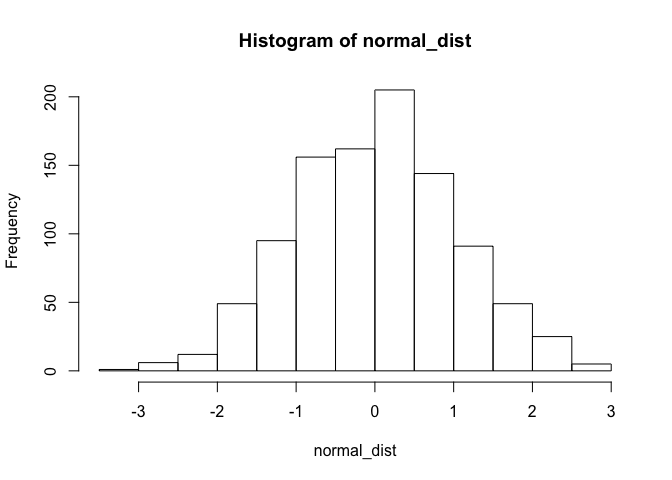
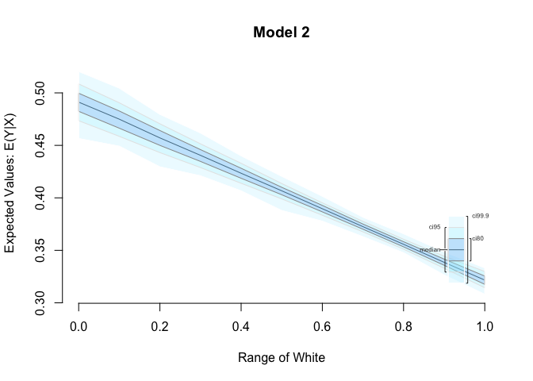
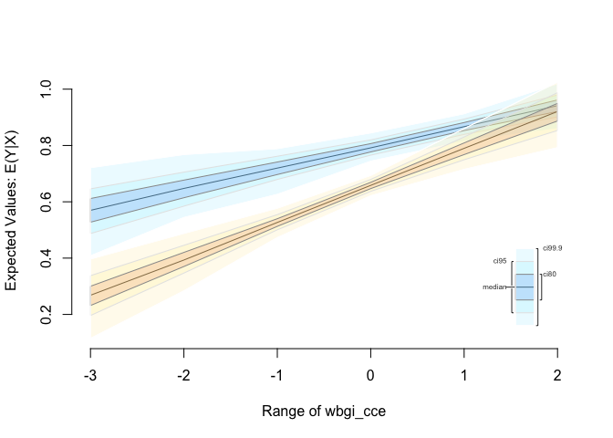

R training for SPP staff (session 1)
====================================

#### Javier Sajuria

#### 2 December 2015

Introduction to R
-----------------

### Scalar objects

``` r
# Create a numeric and a character variable
a <- 5 
class(a) # a is a numeric variable
```

    [1] "numeric"

``` r
a
```

    [1] 5

``` r
b <- "Yay stats class"
class(b) # b is a string variable
```

    [1] "character"

``` r
b
```

    [1] "Yay stats class"

Save your script, and re-open it to make sure your changes are still there.

### Vectors and subsetting

``` r
# Create a vector
my.vector <- c(10,-7,99,34,0,-5) # a vector
my.vector
```

    [1] 10 -7 99 34  0 -5

``` r
length(my.vector) # how many elements?
```

    [1] 6

``` r
# subsetting
my.vector[1] # 1st vector element
```

    [1] 10

``` r
my.vector[-1] # all elements but the 1st
```

    [1] -7 99 34  0 -5

``` r
my.vector[2:4] # the 2nd to the 4th elements
```

    [1] -7 99 34

``` r
my.vector[c(2,5)] # 2nd and 5th element
```

    [1] -7  0

``` r
my.vector[length(my.vector)] # the last element
```

    [1] -5

``` r
# delete variable 'a' from workspace
rm(a)
# delete everything from workspace
rm(list=ls())
```

### Matrices

``` r
# create a matrix
# type help("matrix") into the console and press ENTER
# read Description, Usage and Arguments
my.matrix1 <- matrix(data = c(1,2,30,40,500,600), nrow = 3, ncol = 2, byrow = TRUE,
                     dimnames = NULL)
my.matrix2 <- matrix(data = c(1,2,30,40,500,600), nrow = 2, ncol = 3, byrow = FALSE)
# How are the matrices different?
my.matrix1
```

         [,1] [,2]
    [1,]    1    2
    [2,]   30   40
    [3,]  500  600

``` r
my.matrix2
```

         [,1] [,2] [,3]
    [1,]    1   30  500
    [2,]    2   40  600

``` r
# subsetting a matrix
my.matrix1[1,2] # element in row 1 and column 2
```

    [1] 2

``` r
my.matrix1[2,1] # element in row 2 and column 1
```

    [1] 30

``` r
my.matrix1[,1] # 1st column only
```

    [1]   1  30 500

``` r
my.matrix1[1:2,] # rows 1 to 2
```

         [,1] [,2]
    [1,]    1    2
    [2,]   30   40

``` r
my.matrix1[c(1,3),] # rows 1 and 3 
```

         [,1] [,2]
    [1,]    1    2
    [2,]  500  600

### Installing and loading packages

Packages are user-generated pieces of code that expand the basic options of R. R is a very flexible language, that allows to go way beyond the base options.

``` r
install.packages("texreg") # Creates tables both in ASCII text, LaTeX or Word, similar to outreg
install.packages("lmtest") # Provides different tests of linear models
install.packages("readxl") # Opens and writes Excel files
install.packages("sandwich") # Calculates heteroskedasticity consistent SEs
install.packages("car") # General functions to run regressions and manage data
install.packages("plm") # Panel data models
install.packages("dplyr") # General data manipulation
install.packages("tidyr") # Further data manipulations
install.packages("ggplot2") # Advanced graphical machine
install.packages("effects")
```

In some cases, we want to install previous versions of packages. In this case, we will install Zelig, a comprehensive package that we will use to estimate and plot predicted probabilities. We will install the same version we are using to teach the MSc students:

``` r
install.packages("https://cran.r-project.org/src/contrib/Archive/Zelig/Zelig_4.2-1.tar.gz", 
                 repos=NULL, 
                 type="source")
```

Once packages are installed, they need to be loaded. The reason is that some packages have overlapping functions with others, so we usually care about the order in which we load them

``` r
library(foreign) ## comes with the basic installation and allows us to open files in other formats such as Stata, SPSS or SAS
library(car)
library(readxl) 
library(texreg)
```

    Version:  1.35
    Date:     2015-04-25
    Author:   Philip Leifeld (University of Konstanz)

    Please cite the JSS article in your publications -- see citation("texreg").

``` r
library(Zelig)
```

    Loading required package: boot

    Attaching package: 'boot'

    The following object is masked from 'package:car':

        logit

    Loading required package: MASS
    Loading required package: sandwich
    ZELIG (Versions 4.2-1, built: 2013-09-12)

    +----------------------------------------------------------------+
    |  Please refer to http://gking.harvard.edu/zelig for full       |
    |  documentation or help.zelig() for help with commands and      |
    |  models support by Zelig.                                      |
    |                                                                |
    |  Zelig project citations:                                      |
    |    Kosuke Imai, Gary King, and Olivia Lau.  (2009).            |
    |    ``Zelig: Everyone's Statistical Software,''                 |
    |    http://gking.harvard.edu/zelig                              |
    |   and                                                          |
    |    Kosuke Imai, Gary King, and Olivia Lau. (2008).             |
    |    ``Toward A Common Framework for Statistical Analysis        |
    |    and Development,'' Journal of Computational and             |
    |    Graphical Statistics, Vol. 17, No. 4 (December)             |
    |    pp. 892-913.                                                |
    |                                                                |
    |   To cite individual Zelig models, please use the citation     |
    |   format printed with each model run and in the documentation. |
    +----------------------------------------------------------------+


    Attaching package: 'Zelig'

    The following object is masked from 'package:utils':

        cite

``` r
library(sandwich)
library(plm)
```

    Loading required package: Formula

``` r
library(effects)
```


    Attaching package: 'effects'

    The following object is masked from 'package:car':

        Prestige

``` r
library(ggplot2)
library(tidyr)
```


    Attaching package: 'tidyr'

    The following object is masked from 'package:texreg':

        extract

``` r
library(lmtest)
```

    Loading required package: zoo

    Attaching package: 'zoo'

    The following objects are masked from 'package:base':

        as.Date, as.Date.numeric

``` r
library(dplyr)
```


    Attaching package: 'dplyr'

    The following object is masked from 'package:plm':

        between

    The following objects are masked from 'package:Zelig':

        combine, summarize

    The following object is masked from 'package:MASS':

        select

    The following objects are masked from 'package:stats':

        filter, lag

    The following objects are masked from 'package:base':

        intersect, setdiff, setequal, union

To set up your working directory, you need to use the `setwd()` function. E.g.:

    setwd("~/R seminar")

Downloading data and descriptive stats
--------------------------------------

One traditional format of data as CSV. These files do not contain any metadata, but they are usually compatible with any statistical software. The way to load a dataset is assigning it to an object (of class `dataframe`). For CSVs, we use `read.csv()`:

``` r
# load the Polity IV dataset
my.data <- read.csv("http://uclspp.github.io/PUBLG100/data/polity.csv")

# View(my.data) # opens a window with the data set
head(my.data) # retrieves the first 6 observations
```

      id scode                          country year polity2 democ nato
    1  1   AFG Afghanistan                      1800      -6     1    0
    2  2   AFG Afghanistan                      1801      -6     1    0
    3  3   AFG Afghanistan                      1802      -6     1    0
    4  4   AFG Afghanistan                      1803      -6     1    0
    5  5   AFG Afghanistan                      1804      -6     1    0
    6  6   AFG Afghanistan                      1805      -6     1    0

``` r
head(my.data, n=10) # you can manually set up the amount of observations shown
```

       id scode                          country year polity2 democ nato
    1   1   AFG Afghanistan                      1800      -6     1    0
    2   2   AFG Afghanistan                      1801      -6     1    0
    3   3   AFG Afghanistan                      1802      -6     1    0
    4   4   AFG Afghanistan                      1803      -6     1    0
    5   5   AFG Afghanistan                      1804      -6     1    0
    6   6   AFG Afghanistan                      1805      -6     1    0
    7   7   AFG Afghanistan                      1806      -6     1    0
    8   8   AFG Afghanistan                      1807      -6     1    0
    9   9   AFG Afghanistan                      1808      -6     1    0
    10 10   AFG Afghanistan                      1809      -6     1    0

``` r
tail(my.data) # retrieves the last 6 observations
```

             id scode                          country year polity2 democ nato
    16889 16889   ZIM Zimbabwe                         2009       1     3    0
    16890 16890   ZIM Zimbabwe                         2010       1     3    0
    16891 16891   ZIM Zimbabwe                         2011       1     3    0
    16892 16892   ZIM Zimbabwe                         2012       1     3    0
    16893 16893   ZIM Zimbabwe                         2013       4     5    0
    16894 16894   ZIM Zimbabwe                         2014       4     5    0

``` r
levels(my.data$country) # levels displays levels of a factor variable
```

      [1] "Afghanistan                     " "Albania                         "
      [3] "Algeria                         " "Angola                          "
      [5] "Argentina                       " "Armenia                         "
      [7] "Australia                       " "Austria                         "
      [9] "Azerbaijan                      " "Baden                           "
     [11] "Bahrain                         " "Bangladesh                      "
     [13] "Bavaria                         " "Belarus                         "
     [15] "Belgium                         " "Benin                           "
     [17] "Bhutan                          " "Bolivia                         "
     [19] "Bosnia                          " "Botswana                        "
     [21] "Brazil                          " "Bulgaria                        "
     [23] "Burkina Faso                    " "Burundi                         "
     [25] "Cambodia                        " "Cameroon                        "
     [27] "Canada                          " "Cape Verde                      "
     [29] "Central African Republic        " "Chad                            "
     [31] "Chile                           " "China                           "
     [33] "Colombia                        " "Comoros                         "
     [35] "Congo Brazzaville               " "Congo Kinshasa                  "
     [37] "Costa Rica                      " "Croatia                         "
     [39] "Cuba                            " "Cyprus                          "
     [41] "Czech Republic                  " "Czechoslovakia                  "
     [43] "Denmark                         " "Djibouti                        "
     [45] "Dominican Republic              " "East Timor                      "
     [47] "Ecuador                         " "Egypt                           "
     [49] "El Salvador                     " "Equatorial Guinea               "
     [51] "Eritrea                         " "Estonia                         "
     [53] "Ethiopia                        " "Fiji                            "
     [55] "Finland                         " "France                          "
     [57] "Gabon                           " "Gambia                          "
     [59] "Georgia                         " "Germany                         "
     [61] "Germany East                    " "Germany West                    "
     [63] "Ghana                           " "Gran Colombia                   "
     [65] "Greece                          " "Guatemala                       "
     [67] "Guinea                          " "Guinea-Bissau                   "
     [69] "Guyana                          " "Haiti                           "
     [71] "Honduras                        " "Hungary                         "
     [73] "India                           " "Indonesia                       "
     [75] "Iran                            " "Iraq                            "
     [77] "Ireland                         " "Israel                          "
     [79] "Italy                           " "Ivory Coast                     "
     [81] "Jamaica                         " "Japan                           "
     [83] "Jordan                          " "Kazakhstan                      "
     [85] "Kenya                           " "Korea                           "
     [87] "Korea North                     " "Korea South                     "
     [89] "Kosovo                          " "Kuwait                          "
     [91] "Kyrgyzstan                      " "Laos                            "
     [93] "Latvia                          " "Lebanon                         "
     [95] "Lesotho                         " "Liberia                         "
     [97] "Libya                           " "Lithuania                       "
     [99] "Luxembourg                      " "Macedonia                       "
    [101] "Madagascar                      " "Malawi                          "
    [103] "Malaysia                        " "Mali                            "
    [105] "Mauritania                      " "Mauritius                       "
    [107] "Mexico                          " "Modena                          "
    [109] "Moldova                         " "Mongolia                        "
    [111] "Montenegro                      " "Morocco                         "
    [113] "Mozambique                      " "Myanmar (Burma)                 "
    [115] "Namibia                         " "Nepal                           "
    [117] "Netherlands                     " "New Zealand                     "
    [119] "Nicaragua                       " "Niger                           "
    [121] "Nigeria                         " "Norway                          "
    [123] "Oman                            " "Orange Free State               "
    [125] "Pakistan                        " "Panama                          "
    [127] "Papal States                    " "Papua New Guinea                "
    [129] "Paraguay                        " "Parma                           "
    [131] "Peru                            " "Philippines                     "
    [133] "Poland                          " "Portugal                        "
    [135] "Prussia                         " "Qatar                           "
    [137] "Romania                         " "Russia                          "
    [139] "Rwanda                          " "Sardinia                        "
    [141] "Saudi Arabia                    " "Saxony                          "
    [143] "Senegal                         " "Serbia                          "
    [145] "Serbia and Montenegro           " "Sierra Leone                    "
    [147] "Singapore                       " "Slovak Republic                 "
    [149] "Slovenia                        " "Solomon Islands                 "
    [151] "Somalia                         " "South Africa                    "
    [153] "South Sudan                     " "Spain                           "
    [155] "Sri Lanka                       " "Sudan                           "
    [157] "Sudan-North                     " "Suriname                        "
    [159] "Swaziland                       " "Sweden                          "
    [161] "Switzerland                     " "Syria                           "
    [163] "Taiwan                          " "Tajikistan                      "
    [165] "Tanzania                        " "Thailand                        "
    [167] "Togo                            " "Trinidad and Tobago             "
    [169] "Tunisia                         " "Turkey                          "
    [171] "Turkmenistan                    " "Tuscany                         "
    [173] "Two Sicilies                    " "UAE                             "
    [175] "Uganda                          " "Ukraine                         "
    [177] "United Kingdom                  " "United Province CA              "
    [179] "United States                   " "Uruguay                         "
    [181] "USSR                            " "Uzbekistan                      "
    [183] "Venezuela                       " "Vietnam                         "
    [185] "Vietnam North                   " "Vietnam South                   "
    [187] "Wuerttemburg                    " "Yemen                           "
    [189] "Yemen North                     " "Yemen South                     "
    [191] "Yugoslavia                      " "Zambia                          "
    [193] "Zimbabwe                        "

``` r
# we drop all oberservations which are not from 1946
my.data <- my.data[my.data$year==1946,]
head(my.data)
```

           id scode                          country year polity2 democ nato
    147   147   AFG Afghanistan                      1946     -10     0    0
    248   248   ALB Albania                          1946      -9     0    0
    531   531   ARG Argentina                        1946      -8   -88    0
    669   669   AUL Australia                        1946      10    10    0
    884   884   AUS Austria                          1946      10    10    0
    1262 1262   BEL Belgium                          1946      10    10    1

``` r
summary(my.data$polity2) # descriptive statistics of polity variable
```

        Min.  1st Qu.   Median     Mean  3rd Qu.     Max.     NA's 
    -10.0000  -7.0000  -1.0000   0.2319   8.0000  10.0000        3 

``` r
# now lets check if western countries were more democratic than the other countries in 1946
table(my.data$nato, my.data$polity2)
```

       
        -10 -9 -8 -7 -6 -5 -4 -3 -1 0 1 2 3 4 5 7 8 10
      0   4  7  3  3  4  3  2  5  3 1 1 5 1 1 3 2 2  8
      1   0  1  0  0  0  0  0  0  0 0 0 0 0 0 1 0 0  9

``` r
# descriptive summary stats of polity variable by nato membership 
summary(my.data$polity2[my.data$nato==0]) # not in nato
```

       Min. 1st Qu.  Median    Mean 3rd Qu.    Max.    NA's 
    -10.000  -7.000  -3.000  -1.207   4.750  10.000       3 

``` r
summary(my.data$polity2[my.data$nato==1]) # nato member
```

       Min. 1st Qu.  Median    Mean 3rd Qu.    Max. 
     -9.000  10.000  10.000   7.818  10.000  10.000 

``` r
## illustration
boxplot(my.data$polity2 ~ as.factor(my.data$nato),
        frame = FALSE,
        main = "Polity IV Scores of NATO founders vs others in 1946",
        xlab = "NATO member",
        ylab = "Polity Score")
```


We can use the `read_excel` function from the `readxl` package to open Excel files. However, unlike with what we did for CSV files, the `read_excel` function does not directly download files, so we need to save them into our working directory.

<a href="http://uclspp.github.io/PUBLG100/data/hsb2.xlsx" type="button" class="btn btn-success">Download 'High School and Beyond' Dataset</a>

Make sure you save it into your working directory and then run:

``` r
student_data <- read_excel("hsb2.xlsx")

head(student_data)
```

    Source: local data frame [6 x 11]

       id female race ses schtyp prog read write math science socst
    1  70      0    4   1      1    1   57    52   41      47    57
    2 121      1    4   2      1    3   68    59   53      63    61
    3  86      0    4   3      1    1   44    33   54      58    31
    4 141      0    4   3      1    3   63    44   47      53    56
    5 172      0    4   2      1    2   47    52   57      53    61
    6 113      0    4   2      1    2   44    52   51      63    61

To open Stata files, we can use the `read.dta()` function:

``` r
world.data <- read.dta("http://uclspp.github.io/PUBLG100/data/QoG2012.dta")
head(world.data)
```

      h_j   wdi_gdpc undp_hdi   wbgi_cce   wbgi_pse former_col lp_lat_abst
    1  -5   628.4074       NA -1.5453584 -1.9343837          0   0.3666667
    2  -5  4954.1982    0.781 -0.8538115 -0.6026081          0   0.4555556
    3  -5  6349.7207    0.704 -0.7301510 -1.7336243          1   0.3111111
    4  NA         NA       NA  1.3267342  1.1980436          0   0.4700000
    5  -5  2856.7517    0.381 -1.2065741 -1.4150945          1   0.1366667
    6  NA 13981.9795    0.800  0.8624368  0.7084046          1   0.1892222

We will start looking at the `student_data` dataset:

``` r
mean(student_data$science) # Mean 
```

    [1] 51.865

``` r
sd(student_data$science) # Standard deviation
```

    [1] 9.936824

``` r
sd(student_data$science)^2 # Variance
```

    [1] 98.74048

``` r
median(student_data$science) # Median
```

    [1] 53

``` r
range(student_data$science) # Minimum and Maximum value
```

    [1] 26 77

``` r
summary(student_data$science)
```

       Min. 1st Qu.  Median    Mean 3rd Qu.    Max. 
      26.00   44.00   53.00   51.86   58.00   77.00 

``` r
hist(student_data$science, main = "Histogram of Science Scores", xlab = "Science Score")
```


Now let's suppose we wanted to find out the highest score in science and also wanted to see the ID of the student who received the highest score.

The [`max()`](http://bit.ly/R_extremes) function tells us the highest score, and [`which.max()`](http://bit.ly/R_which_min) tells us the row number of the student who received it.

``` r
max(student_data$science)
```

    [1] 77

``` r
which.max(student_data$science)
```

    [1] 74

In addition to the median, the 25th percentile (also known as the lower quartile) and 75th percentile (or the upper quartile) are commonly used to describe the distribution of values in a number of fields including standardized test scores, income and wealth statistics and healthcare measurements such as a baby's birth weight or a child's height compared to their respective peer group.

We can calculate percentiles using the [`quantile()`](http://bit.ly/R_quantile) function in R. For example, if we wanted to see the science scores in the 25th, 50th and 75th percentiles, we would call the [`quantile()`](http://bit.ly/R_quantile) function with `c(0.25, 0.5, 0.75)` as the second argument.

``` r
quantile(student_data$science, c(0.25, 0.5, 0.75))
```

    25% 50% 75% 
     44  53  58 

Obtaining the mode is slightly more difficult, but it takes only a couple of extra steps. We will use a categorical variable, such as `race` from the `student_data` file.

#### Factor Variables

The High School and Beyond dataset that we've been using contains categorical variable such as race, gender and socioeconomic status that are coded as numeric data and must be converted to factor variables.

We'll use the following code book to create categorical variables for gender, race, and socioeconomic status.

| Categorical Variable | New Factor Variable   | Levels                                                   |
|----------------------|-----------------------|----------------------------------------------------------|
| female               | gender                | 0 - Male <br> 1 - Female                                 |
| ses                  | socioeconomic\_status | 1 - Low <br> 2 - Middle <br> 3 - High                    |
| race                 | racial\_group         | 1 - Black <br> 2- Asian <br> 3 - Hispanic <br> 4 - White |

We can convert categorical variables to factor variables using the [`factor()`](http://bit.ly/R_factor) function. The [`factor()`](http://bit.ly/R_factor) function needs the categorical variable and the distinct labels for each category (such as "Male", "Female") as the two arguments for creating factor variables.

``` r
student_data$sex <- factor(student_data$female, labels = c("Male", "Female")) 
student_data$socioeconomic_status <- factor(student_data$ses, labels = c("Low", "Middle", "High")) 
student_data$racial_group <- factor(student_data$race, labels = c("Black", "Asian", "Hispanic", "White")) 
```

Based on this, let's get the mode

``` r
race_table <- table(student_data$racial_group) # This tabulates the frequency per value
race_table
```


       Black    Asian Hispanic    White 
          24       11       20      145 

``` r
sort(race_table, decreasing = TRUE)
```


       White    Black Hispanic    Asian 
         145       24       20       11 

Now that we've created factor variables for our categorical data, we can run crosstabs on these newly created factor variables . We know that our dataset has 200 observations, but let's see how many are male students and how many are female students.

``` r
table(student_data$sex)
```


      Male Female 
        91    109 

Next, let's see how the different socioeconomic groups (Low, Middle, High) are represented in our dataset.

``` r
table(student_data$socioeconomic_status)
```


       Low Middle   High 
        47     95     58 

Finally, we can run two-way crosstabs to see how the different racial groups are distributed over the three socioeconomic levels.

``` r
table(student_data$socioeconomic_status, student_data$racial_group)
```

            
             Black Asian Hispanic White
      Low        9     3       11    24
      Middle    11     5        6    73
      High       4     3        3    48

### Visualizing Data

Let's move on to some visualizations starting with a bar chart of socioeconomic status and let's take advantage of the factor variable we created above. Since `socioeconomic_status` is a factor variable, R automatically knows how to draw bars for each factor and label them accordingly.

``` r
# bar charts
barplot(table(student_data$socioeconomic_status))
```


In addition to being able to correctly group and label a bar chart with distinct categories, factor variables can also be used to create box plots automatically with the [`plot()`](http://bit.ly/R_plot) function. The [`plot()`](http://bit.ly/R_plot) function understands that we are interested in a box plot when we pass it a factor variable for the x-axis.

We can use the [`par()`](http://bit.ly/R_par) function to change graphical parameters and instruct R to create a figure with 1 row and 3 columns using the `mfrow=c(1,3)` option. Once the graphical parameters are set, the three plots for gender, race and socioeconomic status variables will be created side-by-side in a single figure.

We would like to rotate the x-axis labels 90 degrees so that they are perpendicular to the axis. Most graphics functions in R support a label style `las` option for rotating axis labels. The `las` option can take these 4 values:

| Value | Axis Labels                           |
|-------|---------------------------------------|
| 0     | Always parallel to the axis [default] |
| 1     | Always horizontal                     |
| 2     | Always perpendicular to the axis      |
| 3     | Always vertical                       |

To rorate the axis labels 90 degrees, we'll use `las = 2` when calling the [`plot()`](http://bit.ly/R_plot) function.

``` r
# science score by gender, race and socioeconomic status
par(mfrow=c(1,3))

# categorical variables are plotted as boxplots
plot(student_data$sex, student_data$science, main = "Gender", las = 2)
plot(student_data$racial_group, student_data$science, main = "Race", las = 2)
plot(student_data$socioeconomic_status, student_data$science, main = "Socioeconomic Status", las = 2)
```


Now let's see if we can visually examine the relationship between science and math scores using a scatter plot. Before we call the [`plot()`](http://bit.ly/R_plot) function we need to reset the graphical parameters to make sure that our figure only contains a single plot by calling the [`par()`](http://bit.ly/R_par) function and using the `mfrow=c(1,1)` option.

``` r
par(mfrow=c(1,1))
plot(student_data$math, student_data$science)
```


### The `apply()` Function

Suppose we wanted to create a new variable called `english` which represented the average of each student's reading and writing scores. We could call the [`mean()`](http://bit.ly/R_mean) function manually for each student and update the `english` variable but that would be inefficient and extremely time consuming. Fortunately, R provide us built-in support for tasks like this with the [`apply()`](http://bit.ly/R_apply) function. The appropriately named [`apply()`](http://bit.ly/R_apply) function allows us to 'apply' any function to either the rows or the columns of a matrix or a data frame in a single call.

Here is a list of arguments the [`apply()`](http://bit.ly/R_apply) function expects and their descriptions:

    apply(x, margin, function)

| Argument   | Description                                                                                                                                                                                                                |
|------------|----------------------------------------------------------------------------------------------------------------------------------------------------------------------------------------------------------------------------|
| `x`        | The first argument is the dataset that we want the apply function to operate on. Since we're averaging over reading and writing scores, we select only the `read` and `write` columns.                                     |
| `margin`   | The second argument tells [`apply()`](http://bit.ly/R_apply) to either apply the function row-by-row (1) or column-by-column (2). We need to apply the mean function to each row by specifying the second argument as `1`. |
| `function` | The third argument is simply the function to be applied to each row, or `mean` in our case.                                                                                                                                |

Let's take a look at [`apply()`](http://bit.ly/R_apply) in action:

``` r
student_data$english <- apply(student_data[c("read", "write")], 1, mean)
```

Let's use [`head()`](http://bit.ly/R_head) to inspect our dataset with the english scores.

``` r
head(student_data)
```

    Source: local data frame [6 x 15]

       id female race ses schtyp prog read write math science socst    sex
    1  70      0    4   1      1    1   57    52   41      47    57   Male
    2 121      1    4   2      1    3   68    59   53      63    61 Female
    3  86      0    4   3      1    1   44    33   54      58    31   Male
    4 141      0    4   3      1    3   63    44   47      53    56   Male
    5 172      0    4   2      1    2   47    52   57      53    61   Male
    6 113      0    4   2      1    2   44    52   51      63    61   Male
    Variables not shown: socioeconomic_status (fctr), racial_group (fctr),
      english (dbl)

### Distributions in R

One of the default packages in R called `stats` provides a number of functions for drawing random samples from a distribution.

The [`rnorm()`](https://bit.ly/R_normal) function, for example, can be used to draw from a normal distribution.

``` r
normal_dist <- rnorm(1000, mean = 0, sd = 1)
head(normal_dist)
```

    [1] -1.6149516  0.7550053 -1.2067655  1.0701133  0.1216741  1.9004983

``` r
hist(normal_dist)
```



The [`runif()`](http://bit.ly/R_uniform) function can be used to draw from a uniform distribution. For example, we can simulate rolling a 6-sided die with the following code.

``` r
num_rolls <- 10 # number of times to roll the dice
rolls <- as.integer(runif(num_rolls, min = 1, max = 7))
rolls
```

     [1] 4 1 5 4 1 2 1 3 1 1

Regression
----------

The basic function for fitting linear models is `lm()`. It is always recommended to create an object with the results from the `lm()` function and then summarise it. The way in which it works is:

    model1 <- lm(DV ~ IV1 + IV2, data)
    summarise(model1)

The arguments are:

| Argument | Description                                   |
|----------|-----------------------------------------------|
| Formula  | `DV ~ IV`                                     |
| data     | The dataset where the variables are contained |

### Fitting the model and displaying results

``` r
# load the communities datasets
communities <- read.csv("http://uclspp.github.io/PUBLG100/data/communities.csv")
communities_employment <- read.csv("http://uclspp.github.io/PUBLG100/data/communities_employment.csv")
```

It seems that `state` and `communityname` are common to both datasets so we can use them to do the merge.

Now let's use the [`merge()`](http://bit.ly/R_merge) function to merge these two datasets together. There are three arguments that we need to provide to the [`merge()`](http://bit.ly/R_merge) function so it knows what we are trying to merge and how.

    merge(x, y, by)

| Argument | Description                                                                                                                                                                                              |
|----------|----------------------------------------------------------------------------------------------------------------------------------------------------------------------------------------------------------|
| `x`      | The first dataset to merge. This is the `communities` dataset in our case.                                                                                                                               |
| `y`      | The second dataset to merge. This is the `communities_employment` dataset.                                                                                                                               |
| `by`     | Name of the column or columns that are common in both datasets. We know that `state` and `communityname` are common to both datasets so we'll pass them as a vector by combining the two names together. |

For more information on how the [`merge()`](http://bit.ly/R_merge) function works, type `help(merge)` in R.

``` r
# merge the two datasets
communities <- merge(communities, communities_employment, by = c("state", "communityname"))

# explore dataset
names(communities)
```

     [1] "state"            "communityname"    "county"          
     [4] "community"        "fold"             "population"      
     [7] "householdsize"    "racepctblack"     "racePctWhite"    
    [10] "racePctAsian"     "racePctHisp"      "agePct12t21"     
    [13] "agePct12t29"      "agePct16t24"      "agePct65up"      
    [16] "numbUrban"        "pctUrban"         "medIncome"       
    [19] "pctWWage"         "pctWFarmSelf"     "pctWInvInc"      
    [22] "pctWSocSec"       "pctWPubAsst"      "pctWRetire"      
    [25] "medFamInc"        "perCapInc"        "whitePerCap"     
    [28] "blackPerCap"      "indianPerCap"     "AsianPerCap"     
    [31] "OtherPerCap"      "HispPerCap"       "NumUnderPov"     
    [34] "PctPopUnderPov"   "PctLess9thGrade"  "PctNotHSGrad"    
    [37] "PctBSorMore"      "PctUnemployed"    "PctEmploy"       
    [40] "PctEmplManu"      "PctEmplProfServ"  "PctOccupManu"    
    [43] "PctOccupMgmtProf"

``` r
View(communities)
```

Since our dataset has more columns than we need, let's select only the ones we're interested in and rename them with meaningful names. One approach would be to use either the [`subset()`](http://bit.ly/R_subset) function or the square bracket [`[ ]` extraction operator](http://bit.ly/R_extract) for selecting the columns we're interested in. But the easiest way to accomplish this is with the dplyr [`select()`](http://bit.ly/R_dplyr) function that allows us select the columns we need and rename them at the same time.

``` r
communities <- select(communities, 
                      state, 
                      Community = communityname, 
                      UnemploymentRate = PctUnemployed, 
                      NoHighSchool = PctNotHSGrad,
                      White = racePctWhite)
```

Now that we've merged the dataset and renamed the columns the way we want, let's try to visualize the data.

``` r
plot(communities$NoHighSchool, communities$UnemploymentRate,
     xlab = "Adults without High School education (%)",
     ylab = "Unemployment Rate")
```


Now we can run the bivariate model:

``` r
model1 <- lm(UnemploymentRate ~ NoHighSchool, data = communities)

summary(model1)
```


    Call:
    lm(formula = UnemploymentRate ~ NoHighSchool, data = communities)

    Residuals:
         Min       1Q   Median       3Q      Max 
    -0.42347 -0.08499 -0.01189  0.07711  0.56470 

    Coefficients:
                 Estimate Std. Error t value Pr(>|t|)    
    (Intercept)  0.078952   0.006483   12.18   <2e-16 ***
    NoHighSchool 0.742385   0.014955   49.64   <2e-16 ***
    ---
    Signif. codes:  0 '***' 0.001 '**' 0.01 '*' 0.05 '.' 0.1 ' ' 1

    Residual standard error: 0.1352 on 1992 degrees of freedom
    Multiple R-squared:  0.553, Adjusted R-squared:  0.5527 
    F-statistic:  2464 on 1 and 1992 DF,  p-value: < 2.2e-16

Now let's plot the regression line with our observations using the [`abline()`](http://bit.ly/R_abline) function.

``` r
plot(communities$NoHighSchool, communities$UnemploymentRate,
     xlab = "Adults without High School education (%)",
     ylab = "Unemployment Rate")
abline(model1, col = "red")
```


Let's take a look at how to display the output of a regression model on the screen using the [`screenreg()`](http://bit.ly/R_texreg) function from `texreg`.

``` r
screenreg(model1)
```


    =========================
                  Model 1    
    -------------------------
    (Intercept)      0.08 ***
                    (0.01)   
    NoHighSchool     0.74 ***
                    (0.01)   
    -------------------------
    R^2              0.55    
    Adj. R^2         0.55    
    Num. obs.     1994       
    RMSE             0.14    
    =========================
    *** p < 0.001, ** p < 0.01, * p < 0.05

Now, let's fit a multiple regression model and use `screenreg()` to display both models side by side. We can also use `htmlreg()` to create a Word file with the models:

``` r
model2 <- lm(UnemploymentRate ~ NoHighSchool + White, data = communities)
summary(model2)
```


    Call:
    lm(formula = UnemploymentRate ~ NoHighSchool + White, data = communities)

    Residuals:
         Min       1Q   Median       3Q      Max 
    -0.37864 -0.08488 -0.01502  0.07402  0.57313 

    Coefficients:
                 Estimate Std. Error t value Pr(>|t|)    
    (Intercept)   0.24477    0.01477   16.57   <2e-16 ***
    NoHighSchool  0.64318    0.01649   39.01   <2e-16 ***
    White        -0.16954    0.01368  -12.39   <2e-16 ***
    ---
    Signif. codes:  0 '***' 0.001 '**' 0.01 '*' 0.05 '.' 0.1 ' ' 1

    Residual standard error: 0.1303 on 1991 degrees of freedom
    Multiple R-squared:  0.585, Adjusted R-squared:  0.5846 
    F-statistic:  1403 on 2 and 1991 DF,  p-value: < 2.2e-16

``` r
screenreg(list(model1, model2))
```


    ======================================
                  Model 1      Model 2    
    --------------------------------------
    (Intercept)      0.08 ***     0.24 ***
                    (0.01)       (0.01)   
    NoHighSchool     0.74 ***     0.64 ***
                    (0.01)       (0.02)   
    White                        -0.17 ***
                                 (0.01)   
    --------------------------------------
    R^2              0.55         0.58    
    Adj. R^2         0.55         0.58    
    Num. obs.     1994         1994       
    RMSE             0.14         0.13    
    ======================================
    *** p < 0.001, ** p < 0.01, * p < 0.05

``` r
htmlreg(list(model1, model2), file="models.doc")
```

    The table was written to the file 'models.doc'.

Plotting confidence intervals of linear models
----------------------------------------------

We will use the `ggplot2` package to plot the predicted values of the linear model. `ggplot2` works on the basis of layers. We first create the base layer that contains the data, and then we add the other layers using `+`

``` r
g <- ggplot(data = communities, aes(y = UnemploymentRate, x = NoHighSchool))
g + geom_smooth(method = "lm")
```


``` r
g + geom_point() + geom_smooth(method = "lm") + 
  labs(title = "Model1", x = "Not on High School", y = "Unemployment Rate")
```


This option is limited to bivariate regressions and not to multiple models. The `Zelig` package allows us to estimate the confidence intervals for multiple models. This package requires that we re-estimate the models using their own function (`zelig()`), which is very similar to `lm()` but it also works for other regression models. We then need to define the values of X that we want to plot, and then we can simulate in order to get the confidence intervals

``` r
z.out <- zelig(UnemploymentRate ~ NoHighSchool + White, data = communities, 
               model = "ls", cite=FALSE)
summary(z.out)
```


    Call:
    lm(formula = formula, weights = weights, model = F, data = data)

    Residuals:
         Min       1Q   Median       3Q      Max 
    -0.37864 -0.08488 -0.01502  0.07402  0.57313 

    Coefficients:
                 Estimate Std. Error t value Pr(>|t|)    
    (Intercept)   0.24477    0.01477   16.57   <2e-16 ***
    NoHighSchool  0.64318    0.01649   39.01   <2e-16 ***
    White        -0.16954    0.01368  -12.39   <2e-16 ***
    ---
    Signif. codes:  0 '***' 0.001 '**' 0.01 '*' 0.05 '.' 0.1 ' ' 1

    Residual standard error: 0.1303 on 1991 degrees of freedom
    Multiple R-squared:  0.585, Adjusted R-squared:  0.5846 
    F-statistic:  1403 on 2 and 1991 DF,  p-value: < 2.2e-16

``` r
x.out <- setx(z.out, White = seq(0, 1, 0.1))
s.out <- sim(z.out, x=x.out)
summary(s.out)
```

    Expected Values: E(Y|X) 
                                                    mean          sd       50%
    [NoHighSchool=0.38332998996991, White=0]   0.4912850 0.010690577 0.4911525
    [NoHighSchool=0.38332998996991, White=0.1] 0.4739565 0.009237769 0.4741268
    [NoHighSchool=0.38332998996991, White=0.2] 0.4571479 0.007881687 0.4571415
    [NoHighSchool=0.38332998996991, White=0.3] 0.4402735 0.006979485 0.4399915
    [NoHighSchool=0.38332998996991, White=0.4] 0.4233113 0.005436500 0.4233914
    [NoHighSchool=0.38332998996991, White=0.5] 0.4066605 0.004499378 0.4068849
    [NoHighSchool=0.38332998996991, White=0.6] 0.3895672 0.003402581 0.3896112
    [NoHighSchool=0.38332998996991, White=0.7] 0.3725541 0.003109003 0.3725742
    [NoHighSchool=0.38332998996991, White=0.8] 0.3555850 0.002876609 0.3554357
    [NoHighSchool=0.38332998996991, White=0.9] 0.3387187 0.003604380 0.3387380
    [NoHighSchool=0.38332998996991, White=1]   0.3217179 0.004380531 0.3217305
                                                    2.5%     97.5%
    [NoHighSchool=0.38332998996991, White=0]   0.4709020 0.5119803
    [NoHighSchool=0.38332998996991, White=0.1] 0.4559409 0.4926629
    [NoHighSchool=0.38332998996991, White=0.2] 0.4420286 0.4720256
    [NoHighSchool=0.38332998996991, White=0.3] 0.4266798 0.4538857
    [NoHighSchool=0.38332998996991, White=0.4] 0.4120841 0.4337639
    [NoHighSchool=0.38332998996991, White=0.5] 0.3978156 0.4152649
    [NoHighSchool=0.38332998996991, White=0.6] 0.3831149 0.3957922
    [NoHighSchool=0.38332998996991, White=0.7] 0.3665391 0.3786593
    [NoHighSchool=0.38332998996991, White=0.8] 0.3501994 0.3612224
    [NoHighSchool=0.38332998996991, White=0.9] 0.3317173 0.3455965
    [NoHighSchool=0.38332998996991, White=1]   0.3127192 0.3301088


    Predicted Values: Y|X 
                                                    mean          sd       50%
    [NoHighSchool=0.38332998996991, White=0]   0.4912850 0.010690577 0.4911525
    [NoHighSchool=0.38332998996991, White=0.1] 0.4739565 0.009237769 0.4741268
    [NoHighSchool=0.38332998996991, White=0.2] 0.4571479 0.007881687 0.4571415
    [NoHighSchool=0.38332998996991, White=0.3] 0.4402735 0.006979485 0.4399915
    [NoHighSchool=0.38332998996991, White=0.4] 0.4233113 0.005436500 0.4233914
    [NoHighSchool=0.38332998996991, White=0.5] 0.4066605 0.004499378 0.4068849
    [NoHighSchool=0.38332998996991, White=0.6] 0.3895672 0.003402581 0.3896112
    [NoHighSchool=0.38332998996991, White=0.7] 0.3725541 0.003109003 0.3725742
    [NoHighSchool=0.38332998996991, White=0.8] 0.3555850 0.002876609 0.3554357
    [NoHighSchool=0.38332998996991, White=0.9] 0.3387187 0.003604380 0.3387380
    [NoHighSchool=0.38332998996991, White=1]   0.3217179 0.004380531 0.3217305
                                                    2.5%     97.5%
    [NoHighSchool=0.38332998996991, White=0]   0.4709020 0.5119803
    [NoHighSchool=0.38332998996991, White=0.1] 0.4559409 0.4926629
    [NoHighSchool=0.38332998996991, White=0.2] 0.4420286 0.4720256
    [NoHighSchool=0.38332998996991, White=0.3] 0.4266798 0.4538857
    [NoHighSchool=0.38332998996991, White=0.4] 0.4120841 0.4337639
    [NoHighSchool=0.38332998996991, White=0.5] 0.3978156 0.4152649
    [NoHighSchool=0.38332998996991, White=0.6] 0.3831149 0.3957922
    [NoHighSchool=0.38332998996991, White=0.7] 0.3665391 0.3786593
    [NoHighSchool=0.38332998996991, White=0.8] 0.3501994 0.3612224
    [NoHighSchool=0.38332998996991, White=0.9] 0.3317173 0.3455965
    [NoHighSchool=0.38332998996991, White=1]   0.3127192 0.3301088

``` r
plot(s.out, main = "Model 2")
```



Heteroskedasticity
------------------

To test for heteroskedasticity we use the Breusch-Pagan test, with the `bptest()` function from the `lmtest` package:

``` r
bptest(model2)
```


        studentized Breusch-Pagan test

    data:  model2
    BP = 135.02, df = 2, p-value < 2.2e-16

``` r
vcov(model2) # This function displays the variance-covariance matrix from model1
```

                   (Intercept)  NoHighSchool         White
    (Intercept)   0.0002181035 -0.0001867714 -0.0001830833
    NoHighSchool -0.0001867714  0.0002718532  0.0001095398
    White        -0.0001830833  0.0001095398  0.0001871970

In order to recalculate the standard errors, we use the `coeftest()` function from the `lmtest` package to display the coefficients and their t-tests. One option of this function is that we can replace the variance-covariance matrix with a different (corrected) one. We will use the `vcovHC()` function from the `sandwich` package to estimate the new matrix.

``` r
coeftest(model2) # Shows the coefficients and their corresponding t-tests
```


    t test of coefficients:

                  Estimate Std. Error t value  Pr(>|t|)    
    (Intercept)   0.244768   0.014768  16.574 < 2.2e-16 ***
    NoHighSchool  0.643176   0.016488  39.009 < 2.2e-16 ***
    White        -0.169542   0.013682 -12.392 < 2.2e-16 ***
    ---
    Signif. codes:  0 '***' 0.001 '**' 0.01 '*' 0.05 '.' 0.1 ' ' 1

``` r
coeftest(model2, vcov=vcovHC(model2))
```


    t test of coefficients:

                  Estimate Std. Error t value  Pr(>|t|)    
    (Intercept)   0.244768   0.016054  15.247 < 2.2e-16 ***
    NoHighSchool  0.643176   0.018532  34.706 < 2.2e-16 ***
    White        -0.169542   0.015406 -11.005 < 2.2e-16 ***
    ---
    Signif. codes:  0 '***' 0.001 '**' 0.01 '*' 0.05 '.' 0.1 ' ' 1

### Interactions

We will use the Quality of Government data using four variables:

| Variable     | What is measures                                                    |
|--------------|---------------------------------------------------------------------|
| `undp_hdi`   | Human development index. Higher values, better quality of life.     |
| `wbgi_cce`   | Control of corruption. Higher values, better control of corruption. |
| `former_col` | A former colony or not. 1 indicates former colonies.                |
| `wdi_gdpc`   | GDP/captia in $US. Larger values more average income.               |

``` r
rm(list=ls()) # To clean our environment

# load quality of government institute 2015 dataset
world.data <- read.dta("http://uclspp.github.io/PUBLG100/data/QoG2012.dta")

# we remove NA's
world.data <- na.omit(world.data)

# let's transform the former_col variable into a factor
world.data$former_col <- factor(world.data$former_col, levels=c(0,1), labels = c("No", "Yes"))

# run the multiple regression
m1 <- lm(undp_hdi ~ wbgi_cce + former_col, data = world.data)

# regression table
screenreg(m1)
```


    =========================
                   Model 1   
    -------------------------
    (Intercept)      0.78 ***
                    (0.02)   
    wbgi_cce         0.10 ***
                    (0.01)   
    former_colYes   -0.13 ***
                    (0.02)   
    -------------------------
    R^2              0.57    
    Adj. R^2         0.56    
    Num. obs.      158       
    RMSE             0.12    
    =========================
    *** p < 0.001, ** p < 0.01, * p < 0.05

Now let's run the interaction term:

``` r
m2 <- lm(undp_hdi ~ wbgi_cce * former_col, data = world.data)
summary(m2)
```


    Call:
    lm(formula = undp_hdi ~ wbgi_cce * former_col, data = world.data)

    Residuals:
         Min       1Q   Median       3Q      Max 
    -0.39546 -0.04167  0.00794  0.06415  0.29011 

    Coefficients:
                           Estimate Std. Error t value Pr(>|t|)    
    (Intercept)             0.79211    0.01710  46.315  < 2e-16 ***
    wbgi_cce                0.07467    0.01333   5.603 9.44e-08 ***
    former_colYes          -0.13429    0.02162  -6.211 4.70e-09 ***
    wbgi_cce:former_colYes  0.05600    0.02078   2.695  0.00783 ** 
    ---
    Signif. codes:  0 '***' 0.001 '**' 0.01 '*' 0.05 '.' 0.1 ' ' 1

    Residual standard error: 0.1202 on 154 degrees of freedom
    Multiple R-squared:  0.587, Adjusted R-squared:  0.579 
    F-statistic: 72.97 on 3 and 154 DF,  p-value: < 2.2e-16

``` r
# F-test 
anova(m1, m2) 
```

    Analysis of Variance Table

    Model 1: undp_hdi ~ wbgi_cce + former_col
    Model 2: undp_hdi ~ wbgi_cce * former_col
      Res.Df    RSS Df Sum of Sq      F  Pr(>F)   
    1    155 2.3318                               
    2    154 2.2269  1   0.10499 7.2607 0.00783 **
    ---
    Signif. codes:  0 '***' 0.001 '**' 0.01 '*' 0.05 '.' 0.1 ' ' 1

``` r
# regression table
screenreg(list(m1, m2))
```


    ==============================================
                            Model 1     Model 2   
    ----------------------------------------------
    (Intercept)               0.78 ***    0.79 ***
                             (0.02)      (0.02)   
    wbgi_cce                  0.10 ***    0.07 ***
                             (0.01)      (0.01)   
    former_colYes            -0.13 ***   -0.13 ***
                             (0.02)      (0.02)   
    wbgi_cce:former_colYes                0.06 ** 
                                         (0.02)   
    ----------------------------------------------
    R^2                       0.57        0.59    
    Adj. R^2                  0.56        0.58    
    Num. obs.               158         158       
    RMSE                      0.12        0.12    
    ==============================================
    *** p < 0.001, ** p < 0.01, * p < 0.05

Plotting the interaction terms:

``` r
# Using the plot function with the effects package
plot(effect(term= "wbgi_cce:former_col", mod=m2, x.var = "wbgi_cce"), multiline = TRUE)
```


``` r
# Using ggplot2
g <- ggplot(world.data, aes(x = wbgi_cce, y = undp_hdi, group = former_col, colour = former_col))
g + geom_smooth(method="lm")
```


``` r
# Using Zelig
z.out <- zelig(undp_hdi ~ wbgi_cce * former_col, data = world.data, model="ls", cite=FALSE)
# set covariates for countries that weren't colonised
x.out1 <- setx(z.out, former_col = "No", wbgi_cce = -3:2)
# set covariates for colonised countries
x.out2 <- setx(z.out, former_col = "Yes", wbgi_cce = -3:2)
# simulate 
s.out <- sim(z.out, x = x.out1, x1 = x.out2)
summary(s.out)
```

    Expected Values: E(Y|X) 
                                      mean         sd       50%      2.5%
    [former_col=No, wbgi_cce=-3] 0.5657329 0.04883139 0.5636010 0.4730275
    [former_col=No, wbgi_cce=-2] 0.6422917 0.03717294 0.6413977 0.5690822
    [former_col=No, wbgi_cce=-1] 0.7173848 0.02425738 0.7181697 0.6693696
    [former_col=No, wbgi_cce=0]  0.7920908 0.01706827 0.7926531 0.7589231
    [former_col=No, wbgi_cce=1]  0.8672700 0.01706872 0.8666629 0.8337371
    [former_col=No, wbgi_cce=2]  0.9428224 0.02505369 0.9430139 0.8929875
                                     97.5%
    [former_col=No, wbgi_cce=-3] 0.6624020
    [former_col=No, wbgi_cce=-2] 0.7143001
    [former_col=No, wbgi_cce=-1] 0.7647348
    [former_col=No, wbgi_cce=0]  0.8261120
    [former_col=No, wbgi_cce=1]  0.9023111
    [former_col=No, wbgi_cce=2]  0.9923169


    Expected Values: E(Y|X1) 
                                      mean         sd       50%      2.5%
    [former_col=No, wbgi_cce=-3] 0.2681871 0.04352305 0.2692041 0.1851014
    [former_col=No, wbgi_cce=-2] 0.3972183 0.03076959 0.3963034 0.3395343
    [former_col=No, wbgi_cce=-1] 0.5276009 0.01617994 0.5281814 0.4962307
    [former_col=No, wbgi_cce=0]  0.6576996 0.01286766 0.6579711 0.6318326
    [former_col=No, wbgi_cce=1]  0.7889627 0.02423962 0.7887719 0.7430038
    [former_col=No, wbgi_cce=2]  0.9181464 0.03939396 0.9179150 0.8416299
                                     97.5%
    [former_col=No, wbgi_cce=-3] 0.3526553
    [former_col=No, wbgi_cce=-2] 0.4582696
    [former_col=No, wbgi_cce=-1] 0.5583652
    [former_col=No, wbgi_cce=0]  0.6835169
    [former_col=No, wbgi_cce=1]  0.8337421
    [former_col=No, wbgi_cce=2]  0.9952081


    Predicted Values: Y|X 
                                      mean         sd       50%      2.5%
    [former_col=No, wbgi_cce=-3] 0.5657329 0.04883139 0.5636010 0.4730275
    [former_col=No, wbgi_cce=-2] 0.6422917 0.03717294 0.6413977 0.5690822
    [former_col=No, wbgi_cce=-1] 0.7173848 0.02425738 0.7181697 0.6693696
    [former_col=No, wbgi_cce=0]  0.7920908 0.01706827 0.7926531 0.7589231
    [former_col=No, wbgi_cce=1]  0.8672700 0.01706872 0.8666629 0.8337371
    [former_col=No, wbgi_cce=2]  0.9428224 0.02505369 0.9430139 0.8929875
                                     97.5%
    [former_col=No, wbgi_cce=-3] 0.6624020
    [former_col=No, wbgi_cce=-2] 0.7143001
    [former_col=No, wbgi_cce=-1] 0.7647348
    [former_col=No, wbgi_cce=0]  0.8261120
    [former_col=No, wbgi_cce=1]  0.9023111
    [former_col=No, wbgi_cce=2]  0.9923169


    Predicted Values: Y|X1 
                                      mean         sd       50%      2.5%
    [former_col=No, wbgi_cce=-3] 0.2681871 0.04352305 0.2692041 0.1851014
    [former_col=No, wbgi_cce=-2] 0.3972183 0.03076959 0.3963034 0.3395343
    [former_col=No, wbgi_cce=-1] 0.5276009 0.01617994 0.5281814 0.4962307
    [former_col=No, wbgi_cce=0]  0.6576996 0.01286766 0.6579711 0.6318326
    [former_col=No, wbgi_cce=1]  0.7889627 0.02423962 0.7887719 0.7430038
    [former_col=No, wbgi_cce=2]  0.9181464 0.03939396 0.9179150 0.8416299
                                     97.5%
    [former_col=No, wbgi_cce=-3] 0.3526553
    [former_col=No, wbgi_cce=-2] 0.4582696
    [former_col=No, wbgi_cce=-1] 0.5583652
    [former_col=No, wbgi_cce=0]  0.6835169
    [former_col=No, wbgi_cce=1]  0.8337421
    [former_col=No, wbgi_cce=2]  0.9952081


    First Differences: E(Y|X1) - E(Y|X) 
                                        mean         sd         50%       2.5%
    [former_col=No, wbgi_cce=-3] -0.29754587 0.06626938 -0.29740263 -0.4368443
    [former_col=No, wbgi_cce=-2] -0.24507341 0.04918845 -0.24486657 -0.3369883
    [former_col=No, wbgi_cce=-1] -0.18978386 0.02915835 -0.18975274 -0.2448669
    [former_col=No, wbgi_cce=0]  -0.13439119 0.02097508 -0.13467539 -0.1751177
    [former_col=No, wbgi_cce=1]  -0.07830729 0.02953520 -0.07852311 -0.1359753
    [former_col=No, wbgi_cce=2]  -0.02467595 0.04724487 -0.02521982 -0.1170963
                                       97.5%
    [former_col=No, wbgi_cce=-3] -0.16834027
    [former_col=No, wbgi_cce=-2] -0.15098995
    [former_col=No, wbgi_cce=-1] -0.13249598
    [former_col=No, wbgi_cce=0]  -0.09232021
    [former_col=No, wbgi_cce=1]  -0.02127745
    [former_col=No, wbgi_cce=2]   0.06427530

``` r
plot(s.out)
```



### Interactions: two continuous variables

``` r
# plot of relationship b/w income & the human development index
plot( undp_hdi ~ wdi_gdpc,
      data = world.data,
      xlim = c( xmin = 0, xmax = 65000),
      ylim = c( ymin = 0, ymax = 1),
      frame = FALSE,
      xlab = "World Bank GDP/captia",
      ylab = "Human Development Index",
      main = "Relationship b/w Income and Quality of Life")

# add the regression line 
abline(lm(undp_hdi ~ wdi_gdpc, data = world.data))

# lowess line
lines(lowess(world.data$wdi_gdpc, world.data$undp_hdi), col="red")
```


To estimate the square effect, we need to use the `I()` index option

``` r
# we include a quadradic term for income
m3 <- lm(undp_hdi ~ wdi_gdpc + I(wdi_gdpc^2), 
               data = world.data)

# regression output
summary(m3)
```


    Call:
    lm(formula = undp_hdi ~ wdi_gdpc + I(wdi_gdpc^2), data = world.data)

    Residuals:
          Min        1Q    Median        3Q       Max 
    -0.261986 -0.070042 -0.003689  0.090414  0.222661 

    Coefficients:
                    Estimate Std. Error t value Pr(>|t|)    
    (Intercept)    5.202e-01  1.305e-02  39.856   <2e-16 ***
    wdi_gdpc       2.549e-05  1.777e-06  14.345   <2e-16 ***
    I(wdi_gdpc^2) -3.534e-10  3.815e-11  -9.264   <2e-16 ***
    ---
    Signif. codes:  0 '***' 0.001 '**' 0.01 '*' 0.05 '.' 0.1 ' ' 1

    Residual standard error: 0.1059 on 155 degrees of freedom
    Multiple R-squared:  0.6776,    Adjusted R-squared:  0.6734 
    F-statistic: 162.9 on 2 and 155 DF,  p-value: < 2.2e-16

We can plot the quadratic relationship

``` r
# Easiest way is with Zelig
z.out <- zelig(undp_hdi ~ wdi_gdpc + I(wdi_gdpc^2), 
               data = world.data, model = "ls", cite = F)

# setting covariates; GDP/captia is a sequence from 0 to 45000 by steps of 1000
x.out <- setx(z.out, wdi_gdpc = seq(0, 60000, 1000))

# simulate using our model and our covariates
s.out <- sim(z.out, x = x.out)

# plot the results
plot(s.out)
```


### Dplyr arrange()

On some occasions you might want to order a data set according to several criteria. `arrange()` from dplyr let's you do that. The default order is ascending. To change to descending, use `desc()`.

``` r
# we order by ex-colony and then hdi 
head(arrange(world.data, former_col, undp_hdi))
```

      h_j  wdi_gdpc undp_hdi    wbgi_cce   wbgi_pse former_col lp_lat_abst
    1   1  550.5092    0.359 -0.50416088 -1.3376564         No   0.0888889
    2  -5  907.1852    0.504 -0.27502340 -1.5360656         No   0.3111111
    3   1 2140.4829    0.668  0.08207824  1.0622551         No   0.5111111
    4  -5 1178.8358    0.671 -1.06050229 -1.3677230         No   0.4333333
    5   1 1904.1436    0.681 -0.93192887 -0.1513168         No   0.5222222
    6  -5 1556.3955    0.701 -0.80801731 -1.0340041         No   0.4555556

``` r
# note: to change the data set you would have to assign it:
# world.data <- arrange(world.data, former_col, undp_hdi)

# the default order is ascending, for descending use:
head(arrange(world.data, desc(former_col, undp_hdi)))
```

      h_j   wdi_gdpc undp_hdi   wbgi_cce   wbgi_pse former_col lp_lat_abst
    1  -5  6349.7207    0.704 -0.7301510 -1.7336243        Yes   0.3111111
    2  -5  2856.7517    0.381 -1.2065741 -1.4150945        Yes   0.1366667
    3  -5  8584.8857    0.853 -0.7264611 -1.0361214        Yes   0.3777778
    4  -5 24506.4883    0.843  0.9507225  0.2304108        Yes   0.2888889
    5  -5   947.5254    0.509 -1.0845362 -0.8523579        Yes   0.2666667
    6   1 19188.6406    0.888  1.3267342  1.0257839        Yes   0.1455556
