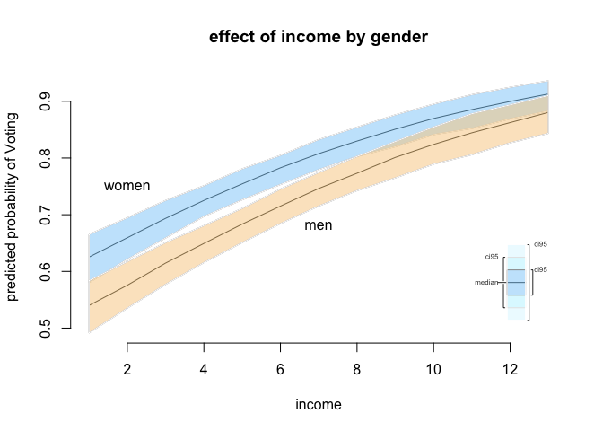

R training for SPP staff (session 2)
====================================

#### Javier Sajuria

#### 9 December 2015

Preliminary steps
-----------------

Remember to set up your working directory and open a new R script

    setwd("WD")

Now, let's load the relevant packages. If you haven't installed them last week check the website to get the right commands:

``` r
library(foreign) 
library(car)
library(readxl) 
library(texreg)
library(Zelig)
library(sandwich)
library(plm)
library(ggplot2)
library(tidyr)
library(lmtest)
library(dplyr)
```

Panel data
----------

We will use the WDI dataset (`wdi.data`).

``` r
wdi <- read.csv("https://raw.githubusercontent.com/UCLSPP/Staff-R-training/master/Week1/wdi.csv")
```

The function used to fit the panel data models is plm, and contains (at least) the following parameters:

    plm(formula, data, index=c(unit, time), effect = c("individual","time","twoways"),
        model = c("within","random"))

The arguments are:

| *Argument* | *Description*                                                                                                              |
|------------|----------------------------------------------------------------------------------------------------------------------------|
| `formula`  | `DV ~ IV`                                                                                                                  |
| `data`     | The dataset that contains our variables                                                                                    |
| `index`    | Here we specify which variable contains the units and which contains the time                                              |
| `effect`   | This argument defines whether we are estimating the individual fixed effects, the time fixed effect, or both (`"twoways"`) |
| `model`    | Fixed effects (`"within"`) or random effects (`"random"`)                                                                  |

### Fixed effects:

``` r
# We first estimate the OLS model, as a baseline

ols <- lm(MaternalMortality ~ SafeWaterAccess + HealthExpenditure + PregnantWomenWithAnemia, data = wdi)
summary(ols)
```


    Call:
    lm(formula = MaternalMortality ~ SafeWaterAccess + HealthExpenditure + 
        PregnantWomenWithAnemia, data = wdi)

    Residuals:
        Min      1Q  Median      3Q     Max 
    -482.57  -79.98   -3.27   53.53 1878.73 

    Coefficients:
                            Estimate Std. Error t value Pr(>|t|)    
    (Intercept)             502.7318    35.9275   13.99   <2e-16 ***
    SafeWaterAccess         -10.0763     0.2660  -37.88   <2e-16 ***
    HealthExpenditure        24.0685     1.6357   14.71   <2e-16 ***
    PregnantWomenWithAnemia  11.7967     0.4105   28.74   <2e-16 ***
    ---
    Signif. codes:  0 '***' 0.001 '**' 0.01 '*' 0.05 '.' 0.1 ' ' 1

    Residual standard error: 191.2 on 2930 degrees of freedom
      (7818 observations deleted due to missingness)
    Multiple R-squared:  0.6757,    Adjusted R-squared:  0.6754 
    F-statistic:  2035 on 3 and 2930 DF,  p-value: < 2.2e-16

``` r
fixed_effects <- plm(MaternalMortality ~ SafeWaterAccess + HealthExpenditure + PregnantWomenWithAnemia, 
                     data = wdi, 
                     index = c("CountryCode", "Year"), 
                     model = "within", 
                     effect = "individual")
summary(fixed_effects)
```

    Oneway (individual) effect Within Model

    Call:
    plm(formula = MaternalMortality ~ SafeWaterAccess + HealthExpenditure + 
        PregnantWomenWithAnemia, data = wdi, effect = "individual", 
        model = "within", index = c("CountryCode", "Year"))

    Unbalanced Panel: n=175, T=7-17, N=2934

    Residuals :
        Min.  1st Qu.   Median  3rd Qu.     Max. 
    -563.000  -15.300    0.596   13.300  534.000 

    Coefficients :
                            Estimate Std. Error  t-value  Pr(>|t|)    
    SafeWaterAccess         -8.79494    0.40917 -21.4948 < 2.2e-16 ***
    HealthExpenditure       -4.16778    1.22865  -3.3922 0.0007032 ***
    PregnantWomenWithAnemia  5.91744    0.53636  11.0325 < 2.2e-16 ***
    ---
    Signif. codes:  0 '***' 0.001 '**' 0.01 '*' 0.05 '.' 0.1 ' ' 1

    Total Sum of Squares:    15806000
    Residual Sum of Squares: 10147000
    R-Squared      :  0.35799 
          Adj. R-Squared :  0.33627 
    F-statistic: 512.248 on 3 and 2756 DF, p-value: < 2.22e-16

``` r
fixef(fixed_effects)
```

          AFG       AGO       ALB       ARE       ARG       ARM       AUS 
     895.2281  919.8473  752.9895  722.6399  766.6782  746.9677  778.0787 
          AUT       AZE       BDI       BEL       BEN       BFA       BGD 
     779.1715  544.2196 1336.1258  787.0830  742.5123  754.8887  753.3688 
          BGR       BHR       BHS       BIH       BLR       BLZ       BOL 
     755.1332  682.0568  748.2338  737.8651  762.1208  658.4077  840.5761 
          BRA       BRB       BTN       BWA       CAF       CAN       CHE 
     728.1559  730.6359  868.5490  912.1539 1372.1780  793.7236  781.3137 
          CHL       CHN       CIV       CMR       COG       COL       COM 
     750.4381  666.6156 1084.8413  997.8618  865.5965  677.4029 1031.6335 
          CPV       CRI       CUB       CYP       CZE       DEU       DJI 
     557.8910  741.0169  688.4347  733.1411  758.7518  788.6171  910.2829 
          DNK       DZA       ECU       EGY       ERI       ESP       EST 
     787.8860  749.5304  622.9354  745.5925  939.5437  771.3776  752.8397 
          ETH       FIN       FJI       FRA       FSM       GAB       GBR 
     921.9012  780.0043  621.0829  787.6041  795.9626  789.1134  797.9996 
          GEO       GHA       GIN       GMB       GNB       GNQ       GRC 
     711.1553  725.0188 1093.2592 1240.4976  930.4182  701.4041  757.0488 
          GRD       GTM       GUY       HND       HRV       HTI       HUN 
     689.2499  716.9809  800.3775  749.5464  734.6161  722.1451  751.3423 
          IDN       IND       IRL       IRN       IRQ       ISL       ISR 
     725.4980  753.4940  749.1911  729.9931  594.8984  787.2447  779.3677 
          ITA       JAM       JOR       JPN       KAZ       KEN       KGZ 
     767.9238  726.0583  779.9979  740.0963  704.9217  924.2111  619.6080 
          KHM       KIR       KOR       KWT       LAO       LBN       LBR 
     519.6146  519.7549  723.7069  731.2665  697.6801  697.6807 1343.4727 
          LBY       LCA       LKA       LSO       LTU       LUX       LVA 
     464.0917  697.1185  614.0690 1174.6033  694.7585  779.0533  760.2860 
          MAR       MDA       MDG       MDV       MEX       MKD       MLI 
     713.8166  660.3864  650.9510  728.6406  718.3071  763.1470  873.6898 
          MLT       MMR       MNE       MNG       MOZ       MRT       MUS 
     785.7035  662.5322  734.8331  509.0467  941.7322  905.1176  722.7376 
          MWI       MYS       NAM       NER       NGA       NIC       NLD 
    1130.1263  714.8234  875.2018  825.4572 1184.4262  778.1611  787.6718 
          NOR       NPL       NZL       OMN       PAK       PAN       PER 
     786.9385  907.4428  797.1922  566.9183  791.5726  722.0095  673.4769 
          PHL       PNG       POL       PRT       PRY       QAT       ROM 
     666.0577  387.6952  719.2244  763.5802  671.3381  726.5799  677.4151 
          RUS       RWA       SAU       SDN       SEN       SGP       SLB 
     760.4371 1275.2134  615.8655  789.5044  704.0704  744.3194  680.0273 
          SLE       SLV       SRB       STP       SUR       SVK       SVN 
    2437.3338  649.7161  746.0473  659.5402  833.1217  750.5592  756.9190 
          SWE       SWZ       SYR       TCD       TGO       THA       TJK 
     783.3692  875.6141  662.4981 1343.7694  609.5269  682.0908  438.0624 
          TKM       TMP       TON       TTO       TUN       TUR       TZA 
     400.8341  862.0982  821.1880  701.5059  724.0002  729.9296  913.3639 
          UGA       UKR       URY       USA       UZB       VCT       VEN 
     869.9022  758.7593  745.0221  862.0418  593.4577  698.8435  733.5592 
          VNM       VUT       WSM       YEM       ZAF       ZAR       ZMB 
     617.7027  615.2649  753.9982  733.3686  722.0298  954.9441  707.2729 

``` r
screenreg(list(ols, fixed_effects))
```


    =================================================
                             Model 1      Model 2    
    -------------------------------------------------
    (Intercept)               502.73 ***             
                              (35.93)                
    SafeWaterAccess           -10.08 ***    -8.79 ***
                               (0.27)       (0.41)   
    HealthExpenditure          24.07 ***    -4.17 ***
                               (1.64)       (1.23)   
    PregnantWomenWithAnemia    11.80 ***     5.92 ***
                               (0.41)       (0.54)   
    -------------------------------------------------
    R^2                         0.68         0.36    
    Adj. R^2                    0.68         0.34    
    Num. obs.                2934         2934       
    RMSE                      191.16                 
    =================================================
    *** p < 0.001, ** p < 0.01, * p < 0.05

. The `plmtest()` function can test for the presence for individual or time effects.

``` r
plmtest(fixed_effects, effect="individual")
```


        Lagrange Multiplier Test - (Honda)

    data:  MaternalMortality ~ SafeWaterAccess + HealthExpenditure + PregnantWomenWithAnemia
    normal = 137.93, p-value < 2.2e-16
    alternative hypothesis: significant effects

The null hypothesis for `plmtest()` is that there are no individual effects.

We can model these time fixed effects using the `effect = "time"` argument in `plm()`.

``` r
time_effects <- plm(MaternalMortality ~ SafeWaterAccess + HealthExpenditure + PregnantWomenWithAnemia , 
                    data = wdi, 
                    index = c("CountryCode", "Year"), 
                    model = "within", 
                    effect = "time")
summary(time_effects)
```

    Oneway (time) effect Within Model

    Call:
    plm(formula = MaternalMortality ~ SafeWaterAccess + HealthExpenditure + 
        PregnantWomenWithAnemia, data = wdi, effect = "time", model = "within", 
        index = c("CountryCode", "Year"))

    Unbalanced Panel: n=175, T=7-17, N=2934

    Residuals :
       Min. 1st Qu.  Median 3rd Qu.    Max. 
    -486.00  -80.10   -3.21   51.60 1890.00 

    Coefficients :
                             Estimate Std. Error t-value  Pr(>|t|)    
    SafeWaterAccess         -10.07778    0.26654 -37.810 < 2.2e-16 ***
    HealthExpenditure        23.86712    1.64865  14.477 < 2.2e-16 ***
    PregnantWomenWithAnemia  11.87103    0.41316  28.732 < 2.2e-16 ***
    ---
    Signif. codes:  0 '***' 0.001 '**' 0.01 '*' 0.05 '.' 0.1 ' ' 1

    Total Sum of Squares:    327280000
    Residual Sum of Squares: 106910000
    R-Squared      :  0.67334 
          Adj. R-Squared :  0.66875 
    F-statistic: 2002.18 on 3 and 2914 DF, p-value: < 2.22e-16

``` r
screenreg(list(ols, fixed_effects, time_effects))
```


    ==============================================================
                             Model 1      Model 2      Model 3    
    --------------------------------------------------------------
    (Intercept)               502.73 ***                          
                              (35.93)                             
    SafeWaterAccess           -10.08 ***    -8.79 ***   -10.08 ***
                               (0.27)       (0.41)       (0.27)   
    HealthExpenditure          24.07 ***    -4.17 ***    23.87 ***
                               (1.64)       (1.23)       (1.65)   
    PregnantWomenWithAnemia    11.80 ***     5.92 ***    11.87 ***
                               (0.41)       (0.54)       (0.41)   
    --------------------------------------------------------------
    R^2                         0.68         0.36         0.67    
    Adj. R^2                    0.68         0.34         0.67    
    Num. obs.                2934         2934         2934       
    RMSE                      191.16                              
    ==============================================================
    *** p < 0.001, ** p < 0.01, * p < 0.05

Let's run the the Lagrange Multiplier test on the `time_effects` model again to see if indeed there are time effects in our model. Remeber, the null hypotheses for the test is that there are no time fixed effects.

``` r
plmtest(time_effects, effect="time")
```


        Lagrange Multiplier Test - time effects (Honda)

    data:  MaternalMortality ~ SafeWaterAccess + HealthExpenditure + PregnantWomenWithAnemia
    normal = -2.1755, p-value = 0.02959
    alternative hypothesis: significant effects

The *p-value* tells us that we can reject the null hypothesis as there are indeed time fixed effects present.

In order to control for both country AND time fixed effects, we need to estimate a model using the `effect = "twoways"` argument.

``` r
twoway_effects <- plm(MaternalMortality ~ SafeWaterAccess + HealthExpenditure + PregnantWomenWithAnemia, 
                      data = wdi, 
                      index = c("CountryCode", "Year"), 
                      model = "within", 
                      effect = "twoways")
summary(twoway_effects)
```

    Twoways effects Within Model

    Call:
    plm(formula = MaternalMortality ~ SafeWaterAccess + HealthExpenditure + 
        PregnantWomenWithAnemia, data = wdi, effect = "twoways", 
        model = "within", index = c("CountryCode", "Year"))

    Unbalanced Panel: n=175, T=7-17, N=2934

    Residuals :
        Min.  1st Qu.   Median  3rd Qu.     Max. 
    -566.000  -16.500   -0.454   14.400  536.000 

    Coefficients :
                            Estimate Std. Error  t-value  Pr(>|t|)    
    SafeWaterAccess         -8.55480    0.43546 -19.6455 < 2.2e-16 ***
    HealthExpenditure       -3.68403    1.29204  -2.8513  0.004386 ** 
    PregnantWomenWithAnemia  5.28353    0.68313   7.7343  1.45e-14 ***
    ---
    Signif. codes:  0 '***' 0.001 '**' 0.01 '*' 0.05 '.' 0.1 ' ' 1

    Total Sum of Squares:    12164000
    Residual Sum of Squares: 10125000
    R-Squared      :  0.16761 
          Adj. R-Squared :  0.15653 
    F-statistic: 183.906 on 3 and 2740 DF, p-value: < 2.22e-16

The results of all three models are shown below.

``` r
screenreg(list(fixed_effects, time_effects, twoway_effects), 
          custom.model.names = c("Country Fixed Effects", "Time Fixed Effects", "Twoway Fixed Effects"))
```


    ========================================================================================
                             Country Fixed Effects  Time Fixed Effects  Twoway Fixed Effects
    ----------------------------------------------------------------------------------------
    SafeWaterAccess            -8.79 ***             -10.08 ***           -8.55 ***         
                               (0.41)                 (0.27)              (0.44)            
    HealthExpenditure          -4.17 ***              23.87 ***           -3.68 **          
                               (1.23)                 (1.65)              (1.29)            
    PregnantWomenWithAnemia     5.92 ***              11.87 ***            5.28 ***         
                               (0.54)                 (0.41)              (0.68)            
    ----------------------------------------------------------------------------------------
    R^2                         0.36                   0.67                0.17             
    Adj. R^2                    0.34                   0.67                0.16             
    Num. obs.                2934                   2934                2934                
    ========================================================================================
    *** p < 0.001, ** p < 0.01, * p < 0.05

### Serial Correlation

We will test for serial correlation with Breusch-Godfrey test using `pbgtest()` and provide solutions for correcting it if necessary.

``` r
pbgtest(twoway_effects)
```


        Breusch-Godfrey/Wooldridge test for serial correlation in panel
        models

    data:  MaternalMortality ~ SafeWaterAccess + HealthExpenditure + PregnantWomenWithAnemia
    chisq = 2134.6, df = 7, p-value < 2.2e-16
    alternative hypothesis: serial correlation in idiosyncratic errors

The null hypothesis for the Breusch-Godfrey test is that there is no serial correlation. The `p-value` from the test tells us that we can reject the null hypothesis and confirms the presence of serial corrleation in our error term.

We can correct for serial correlation using `coeftest()` similar to how we corrected for heteroskedastic errors. We'll use the `vcovHC()` function for obtaining a heteroskedasticity-consistent covariance matrix, but since we're interested in correcting for autocorrelation as well, we will specify `method = "arellano"` which corrects for both heteroskedasticity and autocorrelation.

``` r
twoway_effects_hac <- coeftest(twoway_effects, vcov = vcovHC(twoway_effects, method = "arellano", type = "HC3"))

screenreg(list(twoway_effects, twoway_effects_hac),
          custom.model.names = c("Twoway Fixed Effects", "Twoway Fixed Effects (HAC)"))
```


    =========================================================================
                             Twoway Fixed Effects  Twoway Fixed Effects (HAC)
    -------------------------------------------------------------------------
    SafeWaterAccess            -8.55 ***           -8.55 ***                 
                               (0.44)              (1.61)                    
    HealthExpenditure          -3.68 **            -3.68                     
                               (1.29)              (5.88)                    
    PregnantWomenWithAnemia     5.28 ***            5.28 *                   
                               (0.68)              (2.28)                    
    -------------------------------------------------------------------------
    R^2                         0.17                                         
    Adj. R^2                    0.16                                         
    Num. obs.                2934                                            
    =========================================================================
    *** p < 0.001, ** p < 0.01, * p < 0.05

We can see that with heteroskedasticity and autocorrelation consistent (HAC) standard errors, the percent of male population (10 - 29 yr old) is no longer a significant predictor in our model.

### Lagged Dependent Variables (LDV) and Dynamic Models

The `lag()` function generates lagged dependent variables and has the following form:

    lag(x, k)

| Argument | Description                        |
|----------|------------------------------------|
| `x`      | A vector or matrix of observations |
| `k`      | Number of lags. Default is `1`     |

``` r
ldv_model <- 
  plm(MaternalMortality ~ lag(MaternalMortality) + SafeWaterAccess + HealthExpenditure 
      + PregnantWomenWithAnemia, 
                      data = wdi, 
                      index = c("CountryCode", "Year"), 
                      model = "within", 
                      effect = "twoways")
summary(ldv_model)
```

    Twoways effects Within Model

    Call:
    plm(formula = MaternalMortality ~ lag(MaternalMortality) + SafeWaterAccess + 
        HealthExpenditure + PregnantWomenWithAnemia, data = wdi, 
        effect = "twoways", model = "within", index = c("CountryCode", 
            "Year"))

    Unbalanced Panel: n=175, T=7-17, N=2934

    Residuals :
        Min.  1st Qu.   Median  3rd Qu.     Max. 
    -81.9000  -1.7300   0.0802   2.0900  93.1000 

    Coefficients :
                              Estimate Std. Error  t-value  Pr(>|t|)    
    lag(MaternalMortality)   0.9677067  0.0028302 341.9212 < 2.2e-16 ***
    SafeWaterAccess         -0.4353248  0.0700455  -6.2149 5.919e-10 ***
    HealthExpenditure       -0.2857421  0.1957745  -1.4595    0.1445    
    PregnantWomenWithAnemia -0.4721160  0.1047386  -4.5076 6.833e-06 ***
    ---
    Signif. codes:  0 '***' 0.001 '**' 0.01 '*' 0.05 '.' 0.1 ' ' 1

    Total Sum of Squares:    12164000
    Residual Sum of Squares: 231780
    R-Squared      :  0.98094 
          Adj. R-Squared :  0.91575 
    F-statistic: 35250.6 on 4 and 2739 DF, p-value: < 2.22e-16

### Cross Sectional Dependence

We can check for cross sectional dependence using the Pesaran cross sectional dependence test or `pcdtest()`.

``` r
pcdtest(twoway_effects)
```


        Pesaran CD test for cross-sectional dependence in panels

    data:  formula
    z = NaN, p-value = NA
    alternative hypothesis: cross-sectional dependence

As we've seen with other tests, the null hypothesis is that there is no cross sectional dependence. The p-value, however tells that there is indeed cross-sectional dependence and we need to correct it. There are two general approaches to correcting for cross sectional dependence.

**Beck and Katz (1995) method or Panel Corrected Standard Errors (PCSE)**: We can obtain Panel Corrected Standard Errors (PCSE) by first obtaining a robust variance-covariance matrix for panel models with the Beck and Katz (1995) method using the `vcovBK()` and passing it to the familiar `coeftest()` function.

``` r
twoway_effects_pcse <- coeftest(twoway_effects, vcov = vcovBK(twoway_effects, type="HC3", cluster = "group")) 
```

The results from PCSE are sensitive to the ratio between the number of time periods in the dataset (T) and the total number of observations (N). When we're dealing with large datasets (i.e. the T/N ratio is small), we use the Driscoll and Kraay method:

**Driscoll and Kraay (1998) (SCC)**:

``` r
twoway_effects_scc <- coeftest(twoway_effects, vcov = vcovSCC(twoway_effects, type="HC3", cluster = "group"))
```

``` r
screenreg(list(ols, fixed_effects, twoway_effects, ldv_model, twoway_effects_pcse, twoway_effects_scc), 
          custom.model.names = c("Pooled","Country Effects", "Twoway Fixed Effects", "LDV", "PCSE", "SCC"))
```


    ==============================================================================================================
                             Pooled       Country Effects  Twoway Fixed Effects  LDV          PCSE       SCC      
    --------------------------------------------------------------------------------------------------------------
    (Intercept)               502.73 ***                                                                          
                              (35.93)                                                                             
    SafeWaterAccess           -10.08 ***    -8.79 ***        -8.55 ***             -0.44 ***  -8.55 ***  -8.55 ***
                               (0.27)       (0.41)           (0.44)                (0.07)     (1.64)     (0.32)   
    HealthExpenditure          24.07 ***    -4.17 ***        -3.68 **              -0.29      -3.68      -3.68 ***
                               (1.64)       (1.23)           (1.29)                (0.20)     (3.70)     (0.74)   
    PregnantWomenWithAnemia    11.80 ***     5.92 ***         5.28 ***             -0.47 ***   5.28 *     5.28 ***
                               (0.41)       (0.54)           (0.68)                (0.10)     (2.43)     (0.46)   
    lag(MaternalMortality)                                                          0.97 ***                      
                                                                                   (0.00)                         
    --------------------------------------------------------------------------------------------------------------
    R^2                         0.68         0.36             0.17                  0.98                          
    Adj. R^2                    0.68         0.34             0.16                  0.92                          
    Num. obs.                2934         2934             2934                  2934                             
    RMSE                      191.16                                                                              
    ==============================================================================================================
    *** p < 0.001, ** p < 0.01, * p < 0.05

Logistic models
---------------

``` r
# clear environment
rm(list = ls())
```

### Loading Data

We use a subset of the 2005 face-to-face British post election study to explain turnout. We drop missing values (missings are on the same observations for all variables). We also rename `Gender` to `male` because 1 stands for men.

``` r
# load British post election study
bes <- read.dta("http://uclspp.github.io/PUBLG100/data/bes.dta")
head(bes)
```

      cs_id Turnout Vote2001 Income Age Gender PartyID Influence Attention
    1     1       0        1      4  76      0       1         1         8
    2     2       1        1      5  32      1       0         3         8
    3     3       1       NA     NA  NA     NA      NA        NA        NA
    4     4       0        1      1  35      0       0         1         1
    5     5       1        1      7  56      1       0         1         9
    6     6       1        1      4  76      0       1         4         8
      Telephone LeftrightSelf CivicDutyIndex polinfoindex edu15 edu16 edu17
    1         1             7             20            7     1     0     0
    2         1             6             15            5     0     1     0
    3        NA            NA             NA           NA    NA    NA    NA
    4         0             5             26            1     0     1     0
    5         1             9             16            7     0     0     1
    6         1             8             16            4     0     1     0
      edu18 edu19plus in_school in_uni CivicDutyScores
    1     0         0         0      0      -0.6331136
    2     0         0         0      0       1.4794579
    3    NA        NA        NA     NA              NA
    4     0         0         0      0      -2.1466281
    5     0         0         0      0       1.0324940
    6     0         0         0      0       0.3658024

``` r
# frequency table of voter turnout
table(bes$Turnout) 
```


       0    1 
    1079 3712 

``` r
# rename Gender to male b/c 1 = male & remove missings
bes <- bes %>%
  rename(male = Gender) %>%
  na.omit() 
```

### Dplyr summarise()

We will look at summary statistics by groups using `group_by()` and `summarise()`. First we group by the variable `male` and then we calculate mean and standard deviation of voter turnout. The syntax is: `summarise(new.variable = summary.statistic)`. With `summarise_each()` you can calculate descriptive statistics for multiple columns.

``` r
# mean and standard deviation for Turnout by gender
bes %>%
  group_by(male) %>%
  summarise(avg_turnout = mean(Turnout), sd_turnout = sd(Turnout))
```

    Source: local data frame [2 x 3]

      male avg_turnout sd_turnout
    1    0   0.7465517  0.4350791
    2    1   0.7332971  0.4423559

``` r
# mean for multiple columns using "summarise_each"
bes %>% 
  group_by(male) %>%
  summarise_each(funs(mean), Turnout, Vote2001, Age, LeftrightSelf, 
                 CivicDutyIndex, polinfoindex)
```

    Source: local data frame [2 x 7]

      male   Turnout  Vote2001      Age LeftrightSelf CivicDutyIndex
    1    0 0.7465517 0.8400862 51.04914      5.397414       17.35216
    2    1 0.7332971 0.8365019 50.75394      5.409560       17.76697
    Variables not shown: polinfoindex (dbl)

### Regression with a binary dependent variable

We use the `glm()` function to estimate a logistic regression. The syntax is familiar from `lm()` and `plm()`. "glm" stands for generalized linear models and can be used to estimate many different models. The argument `family = binomial(link = "logit")` tells glm that we have a binary dependent variable that our link function is the cumulative logistic function.

``` r
# logit model
model1 <- glm(Turnout ~ Income + polinfoindex + male + edu15 + edu17 + edu18 + 
                edu19plus + in_school + in_uni, family = binomial(link = "logit"),
              data = bes)

# regression output
screenreg(model1)
```


    ============================
                    Model 1     
    ----------------------------
    (Intercept)        -1.14 ***
                       (0.15)   
    Income              0.03    
                       (0.02)   
    polinfoindex        0.38 ***
                       (0.02)   
    male               -0.35 ***
                       (0.08)   
    edu15               0.38 ***
                       (0.10)   
    edu17               0.46 ** 
                       (0.15)   
    edu18               0.11    
                       (0.14)   
    edu19plus           0.24 *  
                       (0.12)   
    in_school           0.15    
                       (0.39)   
    in_uni             -0.72 ** 
                       (0.25)   
    ----------------------------
    AIC              4401.20    
    BIC              4464.53    
    Log Likelihood  -2190.60    
    Deviance         4381.20    
    Num. obs.        4161       
    ============================
    *** p < 0.001, ** p < 0.01, * p < 0.05

### Predicted Probabilities and Predictive Power

To assess the predictive power of our model we will check the percentage of cases that it correctly predicts. If we look at the mean of Turnout we will see that is 0.74. That means 74% of the respondents said that they turned out to vote. If you predict for every respondent that they voted, you will be right for 74% of the people. That is the naive guess and the benchmark for our model. If we predict more than 74% of cases correctly our model adds value.

Below we will estimate predicted probabilities for each observation. That is, the probability our model assigns that a respondent will turn out to vote for every person in our data. To do so we use the `predict()` function. Type `help(predict.glm)` for information on all arguments. We use: `predict(model.name, type = "response")`. The first argument is the glm object (our model name) and the second specifies that we want predicted probabilities.

``` r
# predicted probabilities for all respondents
predicted.probabilities <- predict(model1, type = "response")
```

Now that we have assigned probabilities to people turning out, we have to translate those into outcomes. Turnout is binary. A straightforward way, would be to say: We predict that all people with a predicted probability above 50% vote and all with predicted probabilities below or equal to 50% abstain. We specify this threshold below.

``` r
# threshold to translate predicted probabilities into outcomes
threshold <- .5 
```

We create a new variable `expected.values` that is 1 if our predicted probability (`predicted.probabilites`) is larger than 0.5 and 0 otherwise. This is easily done with the `ifelse()` function. The syntax is as follows:

`ifelse( condition, what to do if condition is true, what to do if condition is false)`

``` r
# set prediction to 1 if predicted probability is larger than 0.5 and put 0 otherwise
expected.values <- ifelse(predicted.probabilities > threshold, yes = 1, no = 0)
```

All we have to do now is to compare our expected values of turnout against the actually observed values of turnout.

We proceed by producing a table of predictions against actual outcomes. With that we will calculate the percentage of correctly predicted cases and compare that to the naive guess. We have the actually observed cases in our dependent variable (`Turnout`). The table is just a frequency table. The percentage of correctly predicted cases is simply the sum of correctly predicted cases over the number of cases.

``` r
 # actually observed outcomes
observed <- bes$Turnout

# putting observed outcomes and predicted outcomes into a table
outcome.table <- table(observed,expected.values)
outcome.table
```

            expected.values
    observed    0    1
           0  160  919
           1  108 2974

``` r
# correctly predicted cases:
# (correct negatives + correct positives) / total number of outcomes
correctly.predicted <- (outcome.table[1,1] + outcome.table[2,2]) / sum(outcome.table)
correctly.predicted
```

    [1] 0.7531843

``` r
# comparing rate of correctly predicted to naive guess
mean(bes$Turnout)
```

    [1] 0.7406873

You can see that our model outperforms the naive guess slightly. The more lopsided the distribution of your binary dependent variable, the harder it is to build a successful model.

### Joint hypothesis testing

We add more explanatory variables to our model: `Influence` and `Age`. `Influence` corresponds to a theory we want to test while `Age` is a socio-economic control variable.

``` r
# esimate the new model 2 including Influence and Age
model2 <- glm(Turnout ~ Income + polinfoindex + Influence + male + Age + 
                edu15 + edu17 + edu18 + edu19plus + in_school + in_uni, 
              family = binomial(link = "logit"), data = bes)

# regression table comparing model 1 and model 2
screenreg( list(model1, model2) )
```


    ==========================================
                    Model 1       Model 2     
    ------------------------------------------
    (Intercept)        -1.14 ***     -3.90 ***
                       (0.15)        (0.22)   
    Income              0.03          0.15 ***
                       (0.02)        (0.02)   
    polinfoindex        0.38 ***      0.25 ***
                       (0.02)        (0.02)   
    male               -0.35 ***     -0.36 ***
                       (0.08)        (0.08)   
    edu15               0.38 ***     -0.34 ** 
                       (0.10)        (0.11)   
    edu17               0.46 **       0.36 *  
                       (0.15)        (0.16)   
    edu18               0.11          0.14    
                       (0.14)        (0.15)   
    edu19plus           0.24 *        0.01    
                       (0.12)        (0.13)   
    in_school           0.15          1.13 ** 
                       (0.39)        (0.40)   
    in_uni             -0.72 **      -0.05    
                       (0.25)        (0.27)   
    Influence                         0.21 ***
                                     (0.02)   
    Age                               0.05 ***
                                     (0.00)   
    ------------------------------------------
    AIC              4401.20       4003.90    
    BIC              4464.53       4079.90    
    Log Likelihood  -2190.60      -1989.95    
    Deviance         4381.20       3979.90    
    Num. obs.        4161          4161       
    ==========================================
    *** p < 0.001, ** p < 0.01, * p < 0.05

We will test if model 2 does better at predicting turnout than model 1. We use the likelihood ratio test. We use the `lmtest` package to test whether that difference is statistically significant using the `lrtest()` function. The syntax is the following:

`lrtest(model with less variables, model with more variables)`

``` r
# the likelihood ratio test
lrtest(model1, model2)
```

    Likelihood ratio test

    Model 1: Turnout ~ Income + polinfoindex + male + edu15 + edu17 + edu18 + 
        edu19plus + in_school + in_uni
    Model 2: Turnout ~ Income + polinfoindex + Influence + male + Age + edu15 + 
        edu17 + edu18 + edu19plus + in_school + in_uni
      #Df  LogLik Df Chisq Pr(>Chisq)    
    1  10 -2190.6                        
    2  12 -1990.0  2 401.3  < 2.2e-16 ***
    ---
    Signif. codes:  0 '***' 0.001 '**' 0.01 '*' 0.05 '.' 0.1 ' ' 1

``` r
# Akaike's Information Criterion
AIC(model1, model2)
```

           df      AIC
    model1 10 4401.200
    model2 12 4003.901

``` r
# Bayesian Infromation Criterion
BIC(model1, model2) 
```

           df      BIC
    model1 10 4464.535
    model2 12 4079.903

### Substantial interpretation

Due to the functional form of the cumulative logistic function, the effect of a change in an independent variable depends on the level of the independent variable, i.e. they are not constant. Interpretation is nonetheless easily accomplished using Zelig. We pick meaningful scenarios and predict the probability that a person will vote based on the scenarios. First, we re-estimate model 2 using zelig.

``` r
# re-estimate model 2 using Zelig
z.m2 <- zelig(Turnout ~ Income + polinfoindex + Influence + male + Age + edu15 + 
                edu17 + edu18 + edu19plus + in_school + in_uni, model = "logit", 
              data = bes, cite = FALSE)
```

What are meaningful scenarios? A meaningful scenario is a set of covariate values that corresponds to some case that is interesting in reality. For example, you may want to compare a women with 18 years of education to a man with 18 years of education while keeping all other variables at their means, medians or modes.

We set binary variables to their modes, ordinally scaled variables to their medians and interval scaled variables to their means. By doing so for all variables except education and gender, we compare the average women with 18 years of education to the average man with 18 years of education.

``` r
# average man with 18 years of education
x.male.18edu <- setx(z.m2, male = 1, edu18 = 1, Income = mean(bes$Income), 
                     polinfoindex = mean(bes$polinfoindex), Influence = mean(bes$Influence),  
                     Age = mean(bes$Age), edu15 = 0, edu17 = 0,  edu19plus = 0, 
                     in_school = 0, in_uni = 0)

# check covariate values (if you have missings here, the simulation will not work)
t(x.male.18edu$values) 
```

         male edu18 Income   polinfoindex Influence Age      edu15 edu17
    [1,] 1    1     5.321557 5.409277     3.608508  50.91853 0     0    
         edu19plus in_school in_uni
    [1,] 0         0         0     

``` r
# average woman with 18 years of education
x.female.18edu <- setx(z.m2, male = 0, edu18 = 1, Income = mean(bes$Income), 
                       polinfoindex = mean(bes$polinfoindex), Influence = mean(bes$Influence),  
                       Age = mean(bes$Age), edu15 = 0, edu17 = 0,  edu19plus = 0,
                       in_school = 0, in_uni = 0)

# check covariate values (if you have missings here, the simulation will not work)
t(x.female.18edu$values)
```

         male edu18 Income   polinfoindex Influence Age      edu15 edu17
    [1,] 0    1     5.321557 5.409277     3.608508  50.91853 0     0    
         edu19plus in_school in_uni
    [1,] 0         0         0     

Note: Do not worry about the `t()` around the covariate vectors. This simply transposes the vector so that it is printed horizontally instead of vertically.

You see that the only difference between the covariate values in the two scenarios is gender. Therefore, we can compare a women and a man that are identical in all other attributes in our model. This is what keeping other variables constant means.

Now all we have to do is simulate and compare the results.

``` r
# make simulation replicable, the values in set.seed() do not matter
set.seed(123)

# simulate with our two scenarios
s.out <- sim(z.m2, x = x.female.18edu, x1 = x.male.18edu)

# outcomes, check especially first differences
summary(s.out)
```


    Model:  logit 
    Number of simulations:  1000 

    Values of X
      (Intercept)   Income polinfoindex Influence male      Age edu15 edu17
    1           1 5.321557     5.409277  3.608508    0 50.91853     0     0
      edu18 edu19plus in_school in_uni
    1     1         0         0      0
    attr(,"assign")
     [1]  0  1  2  3  4  5  6  7  8  9 10 11

    Values of X1
      (Intercept)   Income polinfoindex Influence male      Age edu15 edu17
    1           1 5.321557     5.409277  3.608508    1 50.91853     0     0
      edu18 edu19plus in_school in_uni
    1     1         0         0      0
    attr(,"assign")
     [1]  0  1  2  3  4  5  6  7  8  9 10 11

    Expected Values: E(Y|X) 
      mean    sd   50%  2.5% 97.5%
     0.838 0.019 0.838 0.795 0.873

    Expected Values: E(Y|X1) 
      mean    sd   50% 2.5% 97.5%
     0.783 0.025 0.784 0.73 0.832

    Predicted Values: Y|X 
         0     1
     0.162 0.838

    Predicted Values: Y|X1 
         0     1
     0.217 0.783

    First Differences: E(Y|X1) - E(Y|X) 
       mean    sd    50%   2.5%  97.5%
     -0.054 0.014 -0.054 -0.082 -0.028

``` r
plot(s.out)
```


Our next step will be to compare two groups like men and women while varying another continuous variable from lowest to highest. We use income here. So, we set a sequence for income, vary gender and keep every other variable constant at its appropriate measure of central tendency.

``` r
# women with income levels from lowest to highest (notice we put education to the mode)
x.fem <- setx(z.m2, male = 0, Income = 1:13, polinfoindex = mean(bes$polinfoindex), 
              Influence = mean(bes$Influence), Age = mean(bes$Age), 
              edu15 = 1, edu17 = 0, edu18 = 0, edu19plus = 0, in_school = 0, in_uni = 0)

# men with income levels from lowest to highest (notice we put education to the mode)
x.mal <- setx(z.m2, male = 1, Income = 1:13, polinfoindex = mean(bes$polinfoindex), 
              Influence = mean(bes$Influence), Age = mean(bes$Age), 
              edu15 = 1, edu17 = 0, edu18 = 0, edu19plus = 0, in_school = 0, in_uni = 0)
```

If you want to check the values we have set again this would work slightly different this time because we have set `Income` to a sequence. You will see the values that you have set if you type `names(x.fem)` and `names(x.mal`).

``` r
# simulation
s.out2 <- sim(z.m2, x = x.fem, x1 = x.mal)
```

We will illustrate our results. The plot function here is slightly different as well. You use `plot.ci()` instead of the usual `plot()` function.

``` r
# final plot
plot.ci (s.out2, 
         ci = 95,
         xlab = "income", 
         ylab = "predicted probability of Voting",
         main = "effect of income by gender")

# add labels manually
text( x = 2, y = .75, labels = "women" )
text( x = 7, y = .68, labels = "men" )
```



BONUS: Maps
-----------

Let's play with some maps. How about if I show you the location of my favourite coffee shops?

``` r
install.packages("devtools")
install.packages("ggmap")
install.packages("leafletR")
```

``` r
library(ggmap)
devtools::install_github("dill/emoGG")
```

    Downloading github repo dill/emoGG@master
    Installing emoGG
    '/Library/Frameworks/R.framework/Resources/bin/R' --no-site-file  \
      --no-environ --no-save --no-restore CMD INSTALL  \
      '/private/var/folders/fm/59csfz2j6xggcgg45nz0kgwr0000gn/T/Rtmpzs5vvV/devtools27f18fd3af8/dill-emoGG-f2436e5'  \
      --library='/Users/javier/Library/R/3.2/library' --install-tests 

``` r
library(emoGG)

sppmap <- qmap("WC1H 9QU", zoom = 16, maptype="hybrid")
```

    Map from URL : http://maps.googleapis.com/maps/api/staticmap?center=WC1H+9QU&zoom=16&size=640x640&scale=2&maptype=hybrid&language=en-EN&sensor=false
    Information from URL : http://maps.googleapis.com/maps/api/geocode/json?address=WC1H%209QU&sensor=false

``` r
coffee_shops <- data.frame(lat=c(51.526259,51.523253, 51.525874, 51.525748, 51.5243248, 51.525302),
                           lon=c(-0.129560,-0.131100, -0.125719, -0.125088, -0.124673, -0.126386),
                           name=c("Fleet River", "Lever & Bloom", "Fork", "Continental Stores", "Petit A", "Bloomsbury Coffee House"))
sppmap + geom_point(data=coffee_shops, aes(x=coffee_shops$lon, y=coffee_shops$lat, colour=name), size=3)
```


``` r
## We can also use emojis!!

sppmap + geom_emoji(data=coffee_shops, aes(x=coffee_shops$lon, y=coffee_shops$lat, colour=name), emoji="2615")
```

 With the following code you can plot an interactive map

``` r
library(leafletR)

q.dat <- toGeoJSON(data = coffee_shops, dest=tempdir(), name="coffee")
q.style <- styleSingle(col=2, lwd=1, alpha=1)
q.map <- leaflet(data = q.dat, base.map = "tls", popup = "name", dest=tempdir(), controls=c("all"), incl.data = TRUE, title = "Javier's favourite coffee shops", style=q.style, size = c(500,500))
q.map
```
